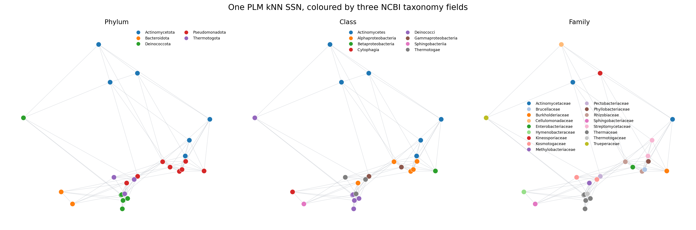
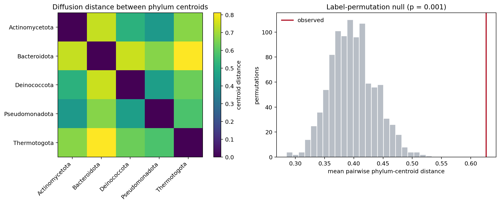
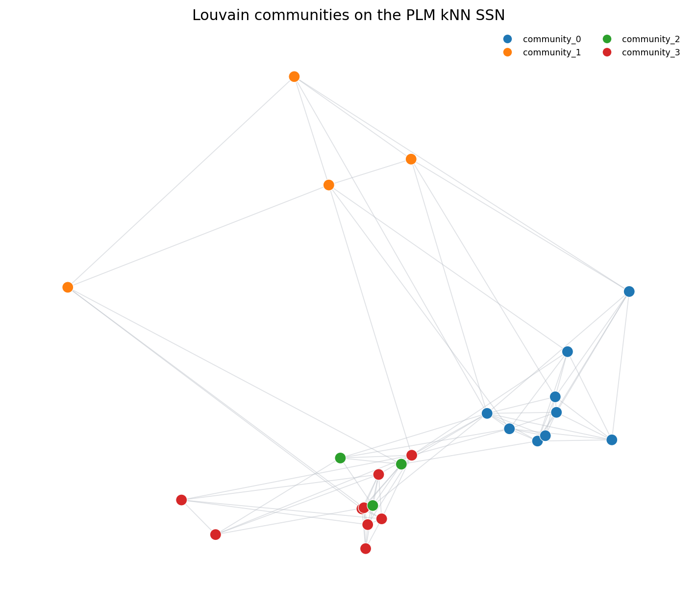
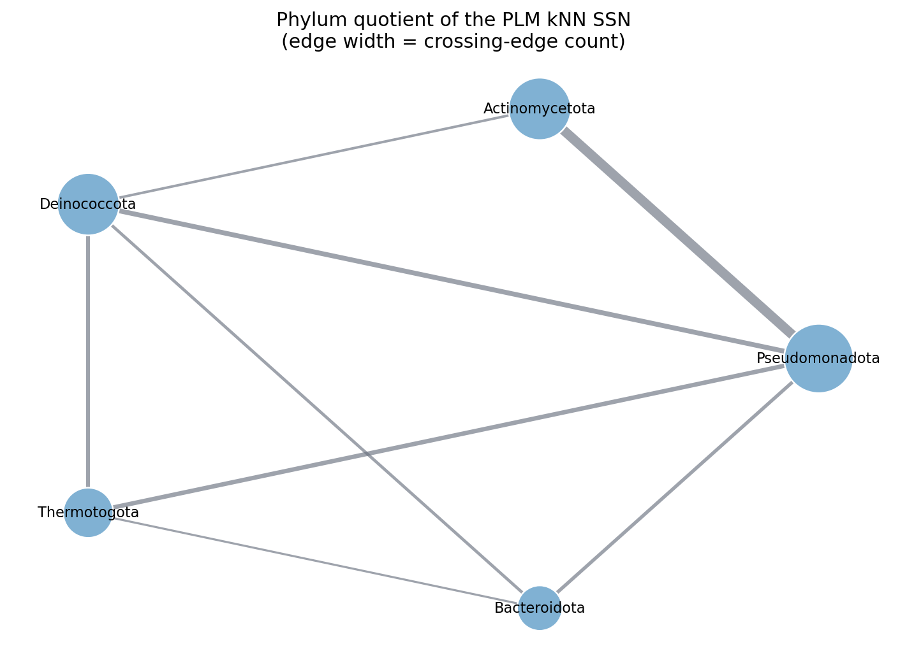

<!-- cookbook: manual -->

# Tutorial: constructing and analysing an SSN

This tutorial starts with an **unaligned protein FASTA file** and a **CSV file
of sequence annotations**. It finishes with three sequence similarity network
(SSN) representations and a small set of graph-aware taxonomic analyses. Every
Python block is intended to be copied into the same notebook, console, or
script, in order.

The optional preface retrieves the example FASTA and CSV from NCBI. If you
already have an unaligned protein FASTA and an annotation CSV, skip the preface
and begin at **1. Install Landscapy**.

In the numbered tutorial you will:

1. install Landscapy;
2. read FASTA records as `BaseNumpySequence` objects;
3. load phylum, class, and family annotations from CSV;
4. calculate protein-language-model (PLM) embeddings;
5. use `FitnessLandscape.build` to construct PLM kNN, TDA, and evolutionary-
   diffusion graphs;
6. attach and visualise the annotations;
7. query one phylum into a new sub-landscape;
8. quantify phylum separation with a category-diffusion permutation test;
9. find Louvain communities and test their association with phylum; and
10. collapse the SSN to a phylum-level quotient graph.

This is a manually run tutorial. It retrieves records from NCBI, downloads an
ESM model on first use, and performs pairwise alignments for evolutionary
diffusion, so it is deliberately excluded from the cookbook CI examples.

## Preface I. Choose where to write the example files

The retrieved FASTA and CSV are placed in a temporary directory. They exist
for this Python session and are removed when it ends. This preface uses only
Python's standard library, so Landscapy does not need to be installed yet.

```python
import csv
from pathlib import Path
from tempfile import TemporaryDirectory
import time
from urllib.parse import urlencode
from urllib.request import Request, urlopen
from xml.etree import ElementTree as ET

temporary_data = TemporaryDirectory(prefix="landscapy-ssn-")
DATA_DIR = Path(temporary_data.name)
FASTA_PATH = DATA_DIR / "solute_binding_proteins.fasta"
ANNOTATION_PATH = DATA_DIR / "solute_binding_protein_taxonomy.csv"

# NCBI asks API users to identify themselves. Replace this before reuse.
NCBI_EMAIL = "your.email@example.org"
```

## Preface II. Define the deterministic NCBI dataset

The accessions below are versioned, so they specify exact sequence records
rather than asking NCBI for the first page of a changing text search. They are
25 bacterial members annotated as **extracellular solute-binding protein
family 1**, drawn from five phyla. Every sequence is 410 residues long.

The equal length is a pragmatic constraint of Landscapy's current TDA
constructor. These records are still **unaligned**: equal string length does
not imply homologous residue positions. The kNN and TDA graphs below use only
PLM geometry, while evolutionary diffusion performs pairwise alignment
internally.

```python
ACCESSIONS = (
    # Pseudomonadota
    "CAG9189542.1", "ACL60506.1", "VTZ64540.1", "AEH85634.1",
    "ACS60911.1", "ACZ77769.1", "AEX04305.1", "AEQ10404.1",
    # Actinomycetota
    "CAQ6901414.1", "ATL83288.1", "CDR14349.1", "ADH92134.1",
    "ADG75066.1", "ABS01875.1",
    # Deinococcota
    "ADD27397.1", "ADD27062.1", "AWR87790.1", "AWR85597.1",
    "AEG34538.1", "ADI15216.1",
    # Thermotogota
    "SSC14160.1", "SSC12933.1", "KUK24120.1",
    # Bacteroidota
    "SMB99496.1", "ACU04954.1",
)

EUTILS = "https://eutils.ncbi.nlm.nih.gov/entrez/eutils"


def ncbi_get(endpoint, **parameters):
    """Return one NCBI E-utilities response."""
    parameters.update({"tool": "landscapy_cookbook", "email": NCBI_EMAIL})
    url = f"{EUTILS}/{endpoint}?{urlencode(parameters)}"
    request = Request(url, headers={"User-Agent": f"landscapy-cookbook ({NCBI_EMAIL})"})
    with urlopen(request, timeout=60) as response:
        return response.read()


def source_tax_id(protein_record):
    """Read the NCBI Taxonomy ID from a GenPept source feature."""
    for feature in protein_record.findall("./GBSeq_feature-table/GBFeature"):
        if feature.findtext("GBFeature_key") != "source":
            continue
        for qualifier in feature.findall("./GBFeature_quals/GBQualifier"):
            name = qualifier.findtext("GBQualifier_name")
            value = qualifier.findtext("GBQualifier_value", default="")
            if name == "db_xref" and value.startswith("taxon:"):
                return value.removeprefix("taxon:")
    raise ValueError("Protein record has no source taxon ID")


def ranked_taxonomy(taxon_record):
    """Return the requested ranks from one NCBI Taxonomy record."""
    ranks = {
        child.findtext("Rank"): child.findtext("ScientificName")
        for child in taxon_record.findall("./LineageEx/Taxon")
    }
    current_rank = taxon_record.findtext("Rank")
    if current_rank:
        ranks[current_rank] = taxon_record.findtext("ScientificName")
    return {rank: ranks.get(rank) for rank in ("phylum", "class", "family")}
```

## Preface III. Retrieve and write the example FASTA and CSV

This block makes two NCBI requests: one for the protein records and one for
their taxonomy records. It then writes a conventional FASTA and CSV. The CSV's
`accession` column is the key that will keep annotations attached to the right
sequence even if a table is reordered.

```python
protein_xml = ncbi_get(
    "efetch.fcgi",
    db="protein",
    id=",".join(ACCESSIONS),
    rettype="gb",
    retmode="xml",
)
protein_root = ET.fromstring(protein_xml)
protein_records = {}
for record in protein_root.findall("./GBSeq"):
    accession = record.findtext("GBSeq_accession-version")
    protein_records[accession] = {
        "sequence": record.findtext("GBSeq_sequence", default="").upper(),
        "protein_name": record.findtext("GBSeq_definition"),
        "organism": record.findtext("GBSeq_organism"),
        "tax_id": source_tax_id(record),
    }

missing = [accession for accession in ACCESSIONS if accession not in protein_records]
if missing:
    raise RuntimeError(f"NCBI did not return these accession versions: {missing}")

time.sleep(0.4)  # remain below NCBI's unauthenticated request-rate limit
tax_ids = sorted({record["tax_id"] for record in protein_records.values()})
taxonomy_xml = ncbi_get(
    "efetch.fcgi",
    db="taxonomy",
    id=",".join(tax_ids),
    retmode="xml",
)
taxonomy_root = ET.fromstring(taxonomy_xml)
taxonomy_by_id = {
    taxon.findtext("TaxId"): ranked_taxonomy(taxon)
    for taxon in taxonomy_root.findall("./Taxon")
}

rows = []
fasta_lines = []
for accession in ACCESSIONS:
    record = protein_records[accession]
    sequence = record["sequence"]
    if len(sequence) != 410:
        raise ValueError(f"{accession} has length {len(sequence)}, expected 410")
    noncanonical = sorted(set(sequence) - set("ACDEFGHIKLMNPQRSTVWY"))
    if noncanonical:
        raise ValueError(f"{accession} has non-canonical residues: {noncanonical}")

    taxonomy = taxonomy_by_id[record["tax_id"]]
    rows.append({"accession": accession, **record, **taxonomy})
    fasta_lines.append(f">{accession}")
    fasta_lines.extend(sequence[start:start + 80] for start in range(0, len(sequence), 80))

FASTA_PATH.write_text("\n".join(fasta_lines) + "\n", encoding="utf-8")
annotation_columns = [
    "accession", "protein_name", "organism", "tax_id", "phylum", "class", "family",
]
with ANNOTATION_PATH.open("w", encoding="utf-8", newline="") as handle:
    writer = csv.DictWriter(handle, fieldnames=annotation_columns)
    writer.writeheader()
    writer.writerows(
        {column: row[column] for column in annotation_columns}
        for row in rows
    )

print(f"Wrote {len(rows)} sequences to {FASTA_PATH}")
print(f"Wrote annotations to {ANNOTATION_PATH}")
for row in rows[:5]:
    print({key: row[key] for key in ("accession", "phylum", "class", "family")})
```

For a larger analysis, do not select records merely because they produce an
attractive graph. Define the inclusion rule before graph construction and
record the accession versions. This small balanced panel is a teaching dataset,
not a representative survey of solute-binding-protein diversity.

The preface is now complete. Keep this Python session open to use the generated
paths below, or substitute paths to your own FASTA and CSV in tutorial step 2.

## 1. Install Landscapy

Landscapy's default installation includes the graph, embedding, TDA, and
alignment features used below. Matplotlib is added for plotting.

```bash
python -m pip install landscapy matplotlib
```

The commands below use the small
`facebook/esm2_t6_8M_UR50D` model on CPU. A CUDA device can make embedding
faster, but CPU execution keeps the example portable.

## 2. Load the unaligned FASTA as `BaseNumpySequence` objects

The small reader below is intentionally explicit: it keeps each FASTA header
as the sequence ID and passes each protein string to
`BaseNumpySequence.from_string`. The default alphabet is Landscapy's canonical
20-amino-acid alphabet. If you skipped the preface, uncomment and edit the two
path assignments at the start of the block.

```python
from pathlib import Path

import matplotlib.pyplot as plt
from matplotlib.lines import Line2D
import networkx as nx
import numpy as np
import pandas as pd
from scipy.spatial.distance import pdist
from sklearn.decomposition import PCA
from sklearn.metrics import normalized_mutual_info_score

from fitness_landscape import BaseNumpySequence, FitnessLandscape
from fitness_landscape.analysis import category_diffusion_hierarchy, graph_properties
from fitness_landscape.analysis.graph import annotate_louvain_communities
from fitness_landscape.core import AnnotationLayer
from fitness_landscape.embedding import ESMEmbedder

# If you skipped the NCBI preface, uncomment these lines and use your files.
# FASTA_PATH = Path("path/to/your_unaligned_proteins.fasta")
# ANNOTATION_PATH = Path("path/to/your_annotations.csv")

if "FASTA_PATH" not in globals() or "ANNOTATION_PATH" not in globals():
    raise NameError("Set FASTA_PATH and ANNOTATION_PATH to your input files")

# From a Landscapy source checkout, these files appear beside this tutorial.
# Use Path("ssn_tutorial_figures") instead when running elsewhere.
FIGURE_DIR = Path("docs/cookbook/tutorial_ssn_figures")
FIGURE_DIR.mkdir(parents=True, exist_ok=True)


def read_fasta(path):
    records = []
    name = None
    pieces = []
    for raw_line in Path(path).read_text(encoding="utf-8").splitlines():
        line = raw_line.strip()
        if not line:
            continue
        if line.startswith(">"):
            if name is not None:
                records.append((name, "".join(pieces)))
            name = line[1:].split()[0]
            pieces = []
        else:
            pieces.append(line.upper())
    if name is not None:
        records.append((name, "".join(pieces)))
    return records


fasta_records = read_fasta(FASTA_PATH)
sequences = [
    BaseNumpySequence.from_string(sequence, sequence_id=accession)
    for accession, sequence in fasta_records
]
sequence_strings = [sequence for _, sequence in fasta_records]

if len({sequence.id for sequence in sequences}) != len(sequences):
    raise ValueError("FASTA identifiers must be unique")
if len({tuple(sequence.to_array()) for sequence in sequences}) != len(sequences):
    raise ValueError("Resolve duplicate protein sequences before building the SSN")

print(type(sequences[0]).__name__, sequences[0].id, len(sequences[0]))
print(f"Loaded {len(sequences)} BaseNumpySequence objects")
```

The sequence ID is metadata; sequence equality is based on sequence content.
Decide whether duplicate strings are biological records, technical replicates,
or data errors before constructing a graph.

## 3. Load and format the annotation CSV

We load taxonomy separately from the FASTA, check its key, and create a table
indexed by accession. `map_by="name"` will later align this index to
`BaseNumpySequence.id`, so row order is not trusted.

```python
annotations = pd.read_csv(ANNOTATION_PATH, dtype={"accession": "string", "tax_id": "string"})

if annotations["accession"].duplicated().any():
    raise ValueError("The annotation CSV has duplicate accession keys")
if set(annotations["accession"]) != {sequence.id for sequence in sequences}:
    raise ValueError("The FASTA IDs and annotation accessions do not match")

for column in ["phylum", "class", "family"]:
    annotations[column] = annotations[column].fillna("unclassified")

taxonomy_records = annotations.set_index("accession")[
    ["organism", "tax_id", "phylum", "class", "family", "protein_name"]
]

print(annotations["phylum"].value_counts())
print(taxonomy_records.head())
```

Phylum, class, and family remain annotations. They are not fitness measurements,
and converting their names to arbitrary integers would invent an ordering that
does not exist.

## 4. Calculate the PLM embedding

This block embeds every sequence. The rows returned by `embed_sequences` follow
the input order, which is the same order as `sequences`. Keep those two objects
together.

```python
MODEL_NAME = "facebook/esm2_t6_8M_UR50D"
embedder = ESMEmbedder(model_name=MODEL_NAME, device="cpu", batch_size=8)
embeddings = embedder.embed_sequences(sequence_strings)

if embeddings.shape[0] != len(sequences) or not np.isfinite(embeddings).all():
    raise ValueError("The PLM embedding is not aligned with the sequence rows")

print(f"Embedding shape: {embeddings.shape}; dtype: {embeddings.dtype}")
```

For a larger dataset, choose the model, model revision, pooling rule, device,
and batch size before looking at the graph. The small ESM model here is chosen
for tutorial runtime, not because it is known to be optimal for this protein
family.

## 5. Build kNN, TDA, and evolutionary-diffusion landscapes

All three constructors receive the same sequence order and the same PLM array.
`embedding_domain="plm"` is important: for kNN it selects ordinary Euclidean
distance between PLM vectors rather than aligned-sequence Hamming distance.

```python
knn_landscape = FitnessLandscape.build(
    sequences,
    graph="knn",
    embeddings=embeddings,
    embedding_domain="plm",
    k=5,
    backend="balltree",
    tie_policy="all",
)

tda_landscape = FitnessLandscape.build(
    sequences,
    graph="tda",
    embeddings=embeddings,
    embedding_domain="plm",
    n_components=3,
    reweight_simplex_edges=True,
)

evolutionary_landscape = FitnessLandscape.build(
    sequences,
    graph="evol_diffusion",
    embeddings=embeddings,
    embedding_domain="plm",
    backend="balltree",
    k=5,
    evolutionary_time=1.0,
    tau=1.0,
    t=1,
    connectivity_threshold=0.01,
    cpus=1,
)

# Always inspect the support created by each representation.
landscapes = {
    "PLM kNN": knn_landscape,
    "PLM TDA": tda_landscape,
    "PLM evolutionary diffusion": evolutionary_landscape,
}

topology_rows = []
for name, landscape in landscapes.items():
    properties = graph_properties(landscape)
    topology_rows.append(
        {
            "graph": name,
            "nodes": landscape.graph.number_of_nodes(),
            "edges": landscape.graph.number_of_edges(),
            "components": properties["components"]["count"],
            "largest_component": properties["components"]["largest_size"],
            "isolates": len(list(nx.isolates(landscape.graph))),
            "density": properties["density"],
        }
    )

topology = pd.DataFrame(topology_rows).set_index("graph")
print(topology)
```

The kNN graph connects PLM neighbours. The TDA graph is the one-skeleton of an
alpha complex after PCA. Evolutionary diffusion uses PLM kNN only as a
candidate-pair prefilter, then aligns and scores those pairs before applying a
reversible graph diffusion. It is not a phylogenetic tree or a branch-length
estimate.

Different edge counts are not a ranking of graph quality. They mean that graph
choice changes the question being asked. Downstream quantities should be
reported with the constructor and parameters that defined their support.

## 6. Attach annotations and visualise them

We attach the same keyed annotation table to every landscape. The rest of the
tutorial uses the kNN landscape, but the TDA and evolutionary-diffusion objects
are now ready for the same analyses.

```python
for landscape in landscapes.values():
    landscape.attach_annotation(
        name="taxonomy",
        data=taxonomy_records,
        map_by="name",
        metadata={
            "source": "NCBI Protein and Taxonomy E-utilities",
            "sequence_keys": "pinned accession.version",
        },
    )

taxonomy = knn_landscape.get_annotation_layer("taxonomy").to_dataframe()
print(taxonomy[["organism", "phylum", "class", "family"]].head())

# Use a fixed PCA projection only as a display layout. The graph above used
# the complete PLM array, not these two display coordinates.
layout_array = PCA(n_components=2, svd_solver="full").fit_transform(embeddings)
positions = {
    knn_landscape.sequence_index_to_node[index]: coordinates
    for index, coordinates in enumerate(layout_array)
}


def draw_categories(ax, landscape, positions, values, title):
    """Draw one annotation with a deterministic categorical colour map."""
    categories = sorted(pd.unique(values).tolist())
    palette = plt.get_cmap("tab10" if len(categories) <= 10 else "tab20")
    colour_by_category = {
        category: palette(index % 20) for index, category in enumerate(categories)
    }
    node_colours = [
        colour_by_category[values.iloc[landscape.sequence_index_for_node(node)]]
        for node in landscape.graph.nodes
    ]
    nx.draw_networkx_edges(
        landscape.graph, positions, ax=ax, edge_color="#b8bec6", alpha=0.45, width=0.7
    )
    nx.draw_networkx_nodes(
        landscape.graph,
        positions,
        ax=ax,
        node_color=node_colours,
        node_size=85,
        edgecolors="white",
        linewidths=0.5,
    )
    handles = [
        Line2D([0], [0], marker="o", linestyle="", color=colour_by_category[category], label=category)
        for category in categories
    ]
    ax.legend(handles=handles, frameon=False, fontsize=7, ncol=2, loc="best")
    ax.set_title(title)
    ax.set_axis_off()


fig, axes = plt.subplots(1, 3, figsize=(18, 6))
for ax, field in zip(axes, ["phylum", "class", "family"]):
    draw_categories(ax, knn_landscape, positions, taxonomy[field], field.capitalize())
fig.suptitle("One PLM kNN SSN, coloured by three NCBI taxonomy fields", fontsize=15)
fig.tight_layout()
fig.savefig(FIGURE_DIR / "annotations.png", dpi=180, bbox_inches="tight")
plt.show()
```



The apparent separation depends on both the PLM representation and the kNN
parameter. Colour separation alone is descriptive; the next sections put
numbers against specific questions.

## 7. Query one phylum into a new sub-landscape

`query_annotations` returns matching sequence indices and graph nodes. We use
its induced graph, subset the PLM rows by those same sequence indices, and
construct an independent `FitnessLandscape` carrying the corresponding
annotations.

```python
chosen_phylum = taxonomy["phylum"].value_counts().index[0]
phylum_query = knn_landscape.query_annotations(
    "taxonomy", {"phylum": chosen_phylum}
)

phylum_landscape = FitnessLandscape(
    sequences=phylum_query.sequences,
    graph=phylum_query.to_subgraph(knn_landscape.graph),
    annotation_layers={
        "taxonomy": AnnotationLayer(
            "taxonomy",
            taxonomy.iloc[phylum_query.sequence_indices].reset_index(drop=True),
        )
    },
    embeddings={"plm": embeddings[np.asarray(phylum_query.sequence_indices)]},
    active_embedding_domain="plm",
)

phylum_properties = graph_properties(phylum_landscape)
print(
    {
        "selected_phylum": chosen_phylum,
        "sequences": len(phylum_landscape.sequences),
        "induced_edges": phylum_landscape.graph.number_of_edges(),
        "components": phylum_properties["components"]["count"],
    }
)
print(phylum_landscape.get_annotation_layer("taxonomy").to_dataframe()["organism"])
```

This is an **induced** sub-landscape: it contains only full-graph edges whose
two endpoints both belong to the selected phylum. A missing within-phylum path
can therefore reflect sampling or the full-graph kNN cutoff; it is not evidence
of an evolutionary barrier by itself.

## 8. Quantify phylum separation with category diffusion

`category_diffusion_hierarchy` embeds the graph using low-frequency normalized-
Laplacian modes, then measures Euclidean distances between phylum centroids in
that graph embedding. This supplies quantitative coordinates without assigning
arbitrary numeric values to phylum names.

We use the mean off-diagonal centroid distance as one predeclared statistic.
The permutation test holds the graph and phylum counts fixed, shuffles the
labels, and asks how often random label placements are at least as separated as
the observed labels.

```python
diffusion = category_diffusion_hierarchy(
    knn_landscape,
    layer="taxonomy",
    annotation_field="phylum",
    embedding_dim=8,
    diffusion_matrix="norm_laplacian",
    weight_key="weight",
    skip_first=True,
    filter_small_embedding=False,
)

diffusion_embedding = diffusion["embedding"]
diffusion_labels = taxonomy.iloc[diffusion["kept_sequence_indices"]]["phylum"].to_numpy()
category_order = list(diffusion["categories"])


def mean_centroid_distance(labels):
    centroids = np.vstack(
        [diffusion_embedding[labels == category].mean(axis=0) for category in category_order]
    )
    return float(pdist(centroids).mean())


observed_separation = mean_centroid_distance(diffusion_labels)
rng = np.random.default_rng(20260824)
n_permutations = 999
null_separations = np.array(
    [mean_centroid_distance(rng.permutation(diffusion_labels)) for _ in range(n_permutations)]
)
permutation_p = (1 + np.count_nonzero(null_separations >= observed_separation)) / (
    n_permutations + 1
)

print(f"Mean phylum-centroid distance: {observed_separation:.4f}")
print(f"Permutation p-value: {permutation_p:.4f}")
print(pd.DataFrame(diffusion["pairwise_distances"], index=category_order, columns=category_order))

fig, axes = plt.subplots(1, 2, figsize=(13, 5))

image = axes[0].imshow(diffusion["pairwise_distances"], cmap="viridis")
axes[0].set_xticks(range(len(category_order)), category_order, rotation=45, ha="right")
axes[0].set_yticks(range(len(category_order)), category_order)
axes[0].set_title("Diffusion distance between phylum centroids")
fig.colorbar(image, ax=axes[0], label="centroid distance")

axes[1].hist(null_separations, bins=24, color="#b8bec6", edgecolor="white")
axes[1].axvline(observed_separation, color="#b2182b", linewidth=2, label="observed")
axes[1].set_xlabel("mean pairwise phylum-centroid distance")
axes[1].set_ylabel("permutations")
axes[1].set_title(f"Label-permutation null (p = {permutation_p:.3f})")
axes[1].legend(frameon=False)

fig.tight_layout()
fig.savefig(FIGURE_DIR / "category_diffusion.png", dpi=180, bbox_inches="tight")
plt.show()
```



This p-value is conditional on this fixed graph, label-count distribution, and
exchangeable-label null. It is not a test that phylum caused the topology, and
the 25 sequence nodes are not 25 independent evolutionary replicates.

## 9. Find Louvain communities and test co-occurrence with phylum

Louvain finds groups with high within-group edge weight relative to the graph's
null model. The fixed seed makes this run repeatable. The function attaches a
new annotation layer rather than replacing the NCBI taxonomy.

We compare community membership with phylum using normalized mutual information
(NMI), then shuffle phylum labels over the fixed communities. NMI is zero when
the labels share no information and one for identical partitions; neither
number implies causation.

```python
community_layer = annotate_louvain_communities(
    knn_landscape,
    annotation_name="louvain",
    weight="weight",
    resolution=1.0,
    seed=20260824,
)
communities = community_layer.to_dataframe()
community_ids = communities["community_id"].astype(int).to_numpy()
phylum_labels = taxonomy["phylum"].to_numpy()

observed_nmi = normalized_mutual_info_score(phylum_labels, community_ids)
rng = np.random.default_rng(20260824)
null_nmi = np.array(
    [
        normalized_mutual_info_score(rng.permutation(phylum_labels), community_ids)
        for _ in range(999)
    ]
)
nmi_p = (1 + np.count_nonzero(null_nmi >= observed_nmi)) / (len(null_nmi) + 1)

cooccurrence = pd.crosstab(
    pd.Series(phylum_labels, name="phylum"),
    pd.Series(community_ids, name="Louvain community"),
)
print(community_layer.metadata)
print(cooccurrence)
print(f"Observed NMI: {observed_nmi:.4f}; permutation p-value: {nmi_p:.4f}")

fig, ax = plt.subplots(figsize=(8, 7))
draw_categories(
    ax,
    knn_landscape,
    positions,
    communities["community_label"],
    "Louvain communities on the PLM kNN SSN",
)
fig.tight_layout()
fig.savefig(FIGURE_DIR / "louvain_communities.png", dpi=180, bbox_inches="tight")
plt.show()
```



Community IDs are arbitrary labels and can change when `k`, edge weights,
resolution, seed, or graph constructor changes. Compare member sets and report
the full parameter record rather than treating community number 0 as a stable
biological entity.

## 10. Build and visualise a phylum quotient graph

A quotient graph collapses every phylum to one node. Here, node area is
proportional to the number of source sequences and edge width is proportional
to the number of original kNN edges crossing between the two phyla.

```python
quotient = knn_landscape.quotient_landscape(
    partition="taxonomy",
    annotation_field="phylum",
    aggregation_function="mean",
    aggregate_annotations=True,
    aggregate_edge_attributes=True,
    edge_attributes=["weight"],
    edge_aggregation_function="mean",
)

quotient_taxonomy = quotient.get_annotation_layer("taxonomy").to_dataframe()
for left, right in quotient.graph.edges:
    left_sources = set(quotient.graph.nodes[left]["source_nodes"])
    right_sources = set(quotient.graph.nodes[right]["source_nodes"])
    crossing_edges = sum(
        (u in left_sources and v in right_sources)
        or (v in left_sources and u in right_sources)
        for u, v in knn_landscape.graph.edges
    )
    quotient.graph[left][right]["crossing_edges"] = crossing_edges

# The circular quotient layout is only for legibility; it adds no new distance.
quotient_positions = nx.circular_layout(quotient.graph)

print(quotient_taxonomy[["phylum", "class", "family"]])
print(list(quotient.graph.edges(data=True)))

fig, ax = plt.subplots(figsize=(8, 6))
node_sizes = [
    450 + 180 * len(quotient.graph.nodes[node]["source_nodes"])
    for node in quotient.graph.nodes
]
maximum_crossing_edges = max(
    data["crossing_edges"] for _, _, data in quotient.graph.edges(data=True)
)
edge_widths = [
    1.0 + 5.0 * quotient.graph[left][right]["crossing_edges"] / maximum_crossing_edges
    for left, right in quotient.graph.edges
]
node_labels = {
    node: quotient_taxonomy.iloc[quotient.sequence_index_for_node(node)]["phylum"]
    for node in quotient.graph.nodes
}

nx.draw_networkx_edges(
    quotient.graph,
    quotient_positions,
    ax=ax,
    width=edge_widths,
    edge_color="#6b7280",
    alpha=0.65,
)
nx.draw_networkx_nodes(
    quotient.graph,
    quotient_positions,
    ax=ax,
    node_size=node_sizes,
    node_color="#80b1d3",
    edgecolors="white",
    linewidths=1.0,
)
nx.draw_networkx_labels(quotient.graph, quotient_positions, labels=node_labels, ax=ax, font_size=9)
ax.set_title("Phylum quotient of the PLM kNN SSN\n(edge width = crossing-edge count)")
ax.set_axis_off()
fig.tight_layout()
fig.savefig(FIGURE_DIR / "phylum_quotient.png", dpi=180, bbox_inches="tight")
plt.show()
```



The quotient is a summary, not a replacement for the original SSN. One
quotient edge may combine many sequence-level edges, and collapsing a phylum
removes its internal fragmentation, variation, and alternative paths. Report
source group sizes and crossing-edge counts with the quotient plot.

## What to replace for your own dataset

Keep the pipeline structure and replace these inputs or decisions explicitly:

- point `FASTA_PATH` and `ANNOTATION_PATH` at your files;
- ensure FASTA IDs exactly match the CSV key;
- choose and record a PLM model and embedding procedure;
- choose `k`, TDA PCA dimension, and evolutionary-diffusion scales before
  comparing outcomes;
- replace `phylum`, `class`, and `family` with your annotation columns; and
- define permutation units that are exchangeable for your biological sampling
  design.

An SSN is a model of neighbourhood support. PLM kNN, TDA, and evolutionary
diffusion encode different neighbourhood definitions, so agreement is useful
and disagreement is information—not a reason to select whichever graph gives
the preferred biological story.
