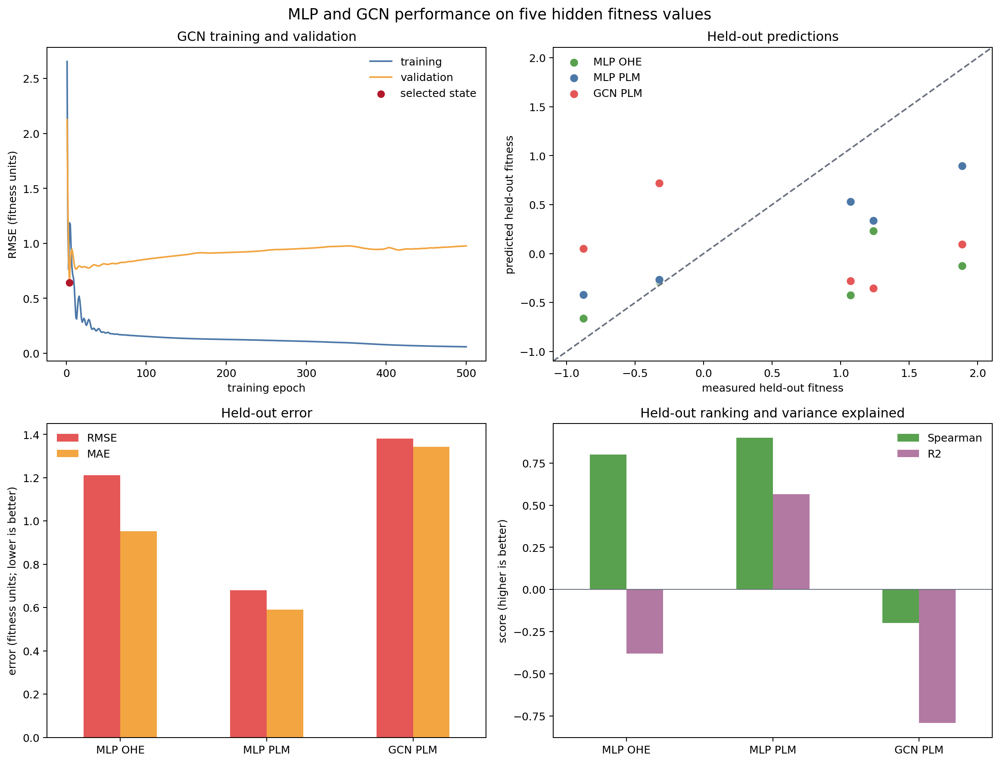

<!-- cookbook: manual -->

# Tutorial: ML training and inference on an SSN

This tutorial continues directly from [Tutorial: Quantitative analysis of an
SSN](tutorial-quantitative-analysis-of-an-ssn.md). Run the two SSN tutorials in
order and keep the same Python session open. They leave us with:

- `knn_landscape`, an annotated `FitnessLandscape` with PLM embeddings and a
  `fitness_mean` layer;
- `positions`, the two-dimensional display coordinates used in the earlier
  figures; and
- 25 sequences whose example fitness values are synthetic.

We will not construct the SSN again. Instead, we will use `landscapy-ml` as the
bridge between this existing Landscapy object and ordinary PyTorch code. Every
Python block is intended to be copied into the same notebook, console, or
script, in order.

In the numbered tutorial you will:

1. prepare Landscapy, `landscapy-ml`, PyTorch, and plotting tools;
2. make a deterministic training, validation, and held-out test split;
3. hide the test fitness values in a separate training layer;
4. export one-hot-encoded (OHE) and protein-language-model (PLM) tensors;
5. define and train the same simple multilayer perceptron (MLP) on each feature
   representation;
6. attach predictions to the landscape as new fitness layers;
7. evaluate the two MLPs only on the hidden test values;
8. export the complete SSN as a PyTorch Geometric graph;
9. define and train a simple graph convolutional network (GCN);
10. attach and compare the GCN predictions; and
11. visualise where the held-out predictions lie on the SSN.

This is a manually run tutorial. PLM embedding can download a model on first
use, and the MLP and GCN blocks perform real model training, so this page is
deliberately excluded from the cookbook CI examples.

The example is designed to teach the software pipeline, not to establish that
one model or feature representation is generally best. Five synthetic held-out
values are enough to make the mechanics visible but not enough for a scientific
model comparison.

## 1. Install the machine-learning packages and prepare the continuation

If you have not already installed the packages, install them in the Python
environment used for the preceding tutorials:

```bash
python -m pip install landscapy landscapy-ml matplotlib
```

The imports below cover every later block. Training is kept on CPU because this
example graph is tiny and CPU execution is the most portable choice.

The constructing tutorial already calculated the `plm` embedding with
Landscapy's `ESMEmbedder`. The explicit check below makes that prerequisite
visible. When adapting only this tutorial to another landscape, Landscapy can
calculate a missing PLM representation before any split-dependent model
training begins.

```python
from pathlib import Path

import matplotlib.pyplot as plt
from matplotlib.lines import Line2D
import networkx as nx
import numpy as np
import pandas as pd
from scipy.stats import spearmanr
from sklearn.metrics import mean_absolute_error, mean_squared_error, r2_score
import torch
from torch import nn
import torch.nn.functional as F
from torch_geometric.nn import GCNConv

from fitness_landscape import NumericFitness
from landscapyml import (
    LandscapeDataset,
    build_regression_graph_from_landscape,
    export_landscape_records,
    infer_fitness_layer_from_landscape,
    make_fitness_target_getter,
    make_preferred_input_getter,
)

ML_FIGURE_DIR = Path("docs/cookbook/tutorial_ml_ssn_figures")
ML_FIGURE_DIR.mkdir(parents=True, exist_ok=True)
DEVICE = torch.device("cpu")

if "knn_landscape" not in globals() or "positions" not in globals():
    raise NameError("Run the two preceding SSN tutorials in the same session first")
if "fitness_mean" not in knn_landscape.fitness_layers:
    raise KeyError("The quantitative SSN tutorial must create 'fitness_mean' first")

MODEL_NAME = "facebook/esm2_t6_8M_UR50D"
if knn_landscape.get_embedding("plm") is None:
    knn_landscape.compute_plm_embeddings(
        domain="plm",
        model_name=MODEL_NAME,
        batch_size=8,
        device="cpu",
    )
knn_landscape.set_active_embedding_domain("plm")

print(
    f"Ready: {len(knn_landscape.sequences)} sequences, "
    f"PLM shape {knn_landscape.get_embedding('plm').shape}, "
    f"fitness layers {sorted(knn_landscape.fitness_layers)}"
)
```

PLM embeddings are calculated from sequences, not fitness. Computing them
before the split also prevents accidental use of a test label while building
features. For a real analysis, record the PLM model name and revision, pooling
rule, and sequence preprocessing alongside the fitted model.

## 2. Make a deterministic split and mask the test fitness

We first copy the complete measured response into `measured_fitness`. This is
the answer key used only after fitting. A fixed random-number seed then assigns
60% of the sequences to training, 20% to validation, and 20% to testing.

The validation rows help select a fitted state during training. The test rows
are not used to fit parameters or choose a state. We replace only their values
with `NaN` in a new layer named `fitness_for_ml`; `NaN` means “unknown”, not
zero. The original `fitness_mean` layer remains unchanged because model
predictions should never overwrite measurements.

This random split mostly asks an interpolation question: can a model predict
unseen values among similar sequences that remain represented in the same SSN?
A family, time, mutation-order, or low-to-high-fitness split asks a harder and
different question. Use the split that matches the prediction problem, and
choose it before comparing models.

The block below also shows the fixed split on the existing display layout.
Node positions and edges are unchanged; only the node colours are new.

```python
measured_fitness = (
    knn_landscape.fitness_layers["fitness_mean"].to_scalar().astype(float).copy()
)
number_of_sequences = len(measured_fitness)

split_rng = np.random.default_rng(20260916)
shuffled_rows = split_rng.permutation(number_of_sequences)
number_test = max(1, round(0.20 * number_of_sequences))
number_validation = max(1, round(0.20 * number_of_sequences))

test_rows = np.sort(shuffled_rows[:number_test])
validation_rows = np.sort(
    shuffled_rows[number_test:number_test + number_validation]
)
train_rows = np.sort(shuffled_rows[number_test + number_validation:])

split_labels = np.full(number_of_sequences, "train", dtype=object)
split_labels[validation_rows] = "validation"
split_labels[test_rows] = "test"

fitness_for_ml = measured_fitness.copy()
fitness_for_ml[test_rows] = np.nan

knn_landscape.attach(
    NumericFitness.from_scalars(
        "fitness_for_ml",
        fitness_for_ml,
        metadata={
            "source_layer": "fitness_mean",
            "test_rows_masked": True,
            "split_seed": 20260916,
        },
    )
)
split_table = pd.DataFrame(
    {"split": split_labels},
    index=[sequence.id for sequence in knn_landscape.sequences],
)
knn_landscape.attach_annotation(
    name="ml_split",
    data=split_table,
    map_by="name",
    metadata={"seed": 20260916, "fractions": "60% train, 20% validation, 20% test"},
)
knn_landscape.view("fitness_for_ml")

print(pd.Series(split_labels, name="split").value_counts())
print(f"Hidden fitness values: {np.isnan(knn_landscape.get_signal()).sum()}")

split_colours = {
    "train": "#4c78a8",
    "validation": "#f2cf5b",
    "test": "#e45756",
}
node_colours = [
    split_colours[split_labels[knn_landscape.sequence_index_for_node(node)]]
    for node in knn_landscape.graph.nodes
]

fig, ax = plt.subplots(figsize=(8, 6))
nx.draw_networkx_edges(
    knn_landscape.graph,
    positions,
    ax=ax,
    edge_color="#b8bec6",
    alpha=0.40,
    width=0.7,
)
nx.draw_networkx_nodes(
    knn_landscape.graph,
    positions,
    ax=ax,
    node_color=node_colours,
    node_size=100,
    edgecolors="white",
    linewidths=0.6,
)
ax.legend(
    handles=[
        Line2D(
            [0],
            [0],
            marker="o",
            linestyle="",
            color=colour,
            label=label,
        )
        for label, colour in split_colours.items()
    ],
    frameon=False,
)
ax.set_title("Deterministic ML split on the PLM kNN SSN")
ax.set_axis_off()
fig.tight_layout()
fig.savefig(ML_FIGURE_DIR / "ml_split.png", dpi=180, bbox_inches="tight")
plt.show()
```


## 3. Define a small MLP and its training function

An MLP treats every sequence as an independent row of numbers. It does not use
SSN edges. We will fit the same architecture twice so that the only deliberate
difference is the input feature representation.

The model stores feature-normalisation values calculated from training rows
only. It also stores the training-target mean and scale, allowing its output to
be returned in the original fitness units during both fitting and inference.
The final class attribute, `layer_kind = "numeric"`, tells `landscapy-ml` that
the output should become a Landscapy `NumericFitness` layer.

```python
class SimpleMLP(nn.Module):
    """A two-hidden-layer regressor for one vector per sequence."""

    layer_kind = "numeric"

    def __init__(
        self,
        input_width,
        feature_mean,
        feature_scale,
        target_mean,
        target_scale,
        feature_domain,
    ):
        super().__init__()
        self.embedding_domain = feature_domain
        self.register_buffer("feature_mean", feature_mean.clone())
        self.register_buffer("feature_scale", feature_scale.clone())
        self.register_buffer("target_mean", target_mean.clone())
        self.register_buffer("target_scale", target_scale.clone())
        self.network = nn.Sequential(
            nn.Linear(input_width, 64),
            nn.ReLU(),
            nn.Linear(64, 32),
            nn.ReLU(),
            nn.Linear(32, 1),
        )

    def forward(self, features):
        if features.ndim == 1:
            features = features.unsqueeze(0)
        features = features.reshape(features.shape[0], -1)
        normalized = (features - self.feature_mean) / self.feature_scale
        standardized_prediction = self.network(normalized).squeeze(-1)
        return standardized_prediction * self.target_scale + self.target_mean

    def predict(self, features):
        return self(features)


def train_mlp(features, targets, feature_domain, *, seed, epochs=500):
    """Fit one MLP and retain the epoch with the lowest validation error."""
    torch.manual_seed(seed)

    train_index = torch.as_tensor(train_rows, dtype=torch.long)
    validation_index = torch.as_tensor(validation_rows, dtype=torch.long)

    feature_mean = features[train_index].mean(dim=0)
    feature_scale = features[train_index].std(dim=0, unbiased=False)
    feature_scale = torch.where(
        feature_scale < 1e-8,
        torch.ones_like(feature_scale),
        feature_scale,
    )
    target_mean = targets[train_index].mean()
    target_scale = targets[train_index].std(unbiased=False).clamp_min(1e-6)

    model = SimpleMLP(
        input_width=features.shape[1],
        feature_mean=feature_mean,
        feature_scale=feature_scale,
        target_mean=target_mean,
        target_scale=target_scale,
        feature_domain=feature_domain,
    ).to(DEVICE)
    features = features.to(DEVICE)
    targets = targets.to(DEVICE)
    train_index = train_index.to(DEVICE)
    validation_index = validation_index.to(DEVICE)

    optimizer = torch.optim.Adam(model.parameters(), lr=0.005, weight_decay=1e-4)
    history = []
    best_validation_rmse = float("inf")
    best_state = None

    for epoch in range(1, epochs + 1):
        model.train()
        optimizer.zero_grad()
        prediction = model(features)
        scaled_error = (
            prediction[train_index] - targets[train_index]
        ) / model.target_scale
        loss = torch.mean(scaled_error**2)
        loss.backward()
        optimizer.step()

        model.eval()
        with torch.no_grad():
            prediction = model(features)
            train_rmse = torch.sqrt(
                torch.mean((prediction[train_index] - targets[train_index]) ** 2)
            ).item()
            validation_rmse = torch.sqrt(
                torch.mean(
                    (prediction[validation_index] - targets[validation_index]) ** 2
                )
            ).item()

        history.append(
            {
                "epoch": epoch,
                "train_rmse": train_rmse,
                "validation_rmse": validation_rmse,
            }
        )
        if validation_rmse < best_validation_rmse:
            best_validation_rmse = validation_rmse
            best_state = {
                name: value.detach().cpu().clone()
                for name, value in model.state_dict().items()
            }

    model.load_state_dict(best_state)
    model.eval()
    return model, pd.DataFrame(history)
```

The architecture is intentionally modest. Five hundred epochs are feasible for
this 25-node teaching example, but epoch count, hidden width, learning rate,
and weight decay are model choices. In a scientific comparison, choose or tune
them without consulting the held-out test values.

## 4. Export OHE and PLM tensors through `landscapy-ml`

`export_landscape_records` asks the existing Landscapy object for row-aligned
features and the named masked target. `LandscapeDataset` then turns those
records into an ordinary PyTorch dataset without inventing a second sequence
order.

For OHE, each amino-acid position becomes a row of zeros with one one, and we
flatten the resulting position-by-alphabet matrix for the MLP. For PLM, each
sequence is already represented by one fixed-width embedding vector.

```python
def export_mlp_tensors(feature_view):
    include_embeddings = feature_view == "embedding"
    exported = export_landscape_records(
        knn_landscape,
        fitness_layers=["fitness_for_ml"],
        feature_view=feature_view,
        include_embeddings=include_embeddings,
    )
    feature_key = "embedding" if include_embeddings else "sequence_tensor"
    dataset = LandscapeDataset(
        exported.records,
        input_getter=make_preferred_input_getter(feature_key),
        target_getter=make_fitness_target_getter(
            "fitness_for_ml",
            dtype=torch.float32,
        ),
    )

    feature_rows = []
    target_rows = []
    for row in range(len(dataset)):
        feature, target = dataset[row]
        feature_rows.append(feature.reshape(-1).float())
        target_rows.append(target.float())
    return torch.stack(feature_rows), torch.stack(target_rows), exported


ohe_features, ohe_targets, ohe_export = export_mlp_tensors("ohe")
plm_features, plm_targets, plm_export = export_mlp_tensors("embedding")

print(
    pd.DataFrame(
        {
            "records": [len(ohe_export.records), len(plm_export.records)],
            "tensor shape": [tuple(ohe_features.shape), tuple(plm_features.shape)],
            "hidden targets": [
                int(torch.isnan(ohe_targets).sum()),
                int(torch.isnan(plm_targets).sum()),
            ],
        },
        index=["OHE", "PLM"],
    )
)
```

Both target tensors contain `NaN` in exactly the five test rows. The fitting
function addresses only `train_rows` and `validation_rows`, so those hidden
values cannot enter either the loss or model selection.

This example's protein strings happen to have equal length, so OHE tensors can
be stacked. They are not a biological alignment. On your own homologous
proteins, flatten position-wise OHE only after producing and documenting a
defensible alignment; PLM vectors are the safer feature view for the unaligned
teaching sequences used here.

## 5. Train the OHE and PLM MLPs

The same training function now receives each exported tensor. Seeds make the
parameter initialisation and fitting order repeatable. The test values remain
hidden throughout this block. The training curve should fall as the MLP learns
the labelled rows. The validation curve often stops improving earlier; its
lowest point selects the state retained by `train_mlp`.

```python
mlp_models = {}
mlp_histories = {}

for feature_domain, features, targets, seed in [
    ("ohe", ohe_features, ohe_targets, 20260917),
    ("plm", plm_features, plm_targets, 20260918),
]:
    model, history = train_mlp(
        features,
        targets,
        feature_domain,
        seed=seed,
        epochs=500,
    )
    mlp_models[feature_domain] = model
    mlp_histories[feature_domain] = history
    best_row = history.loc[history["validation_rmse"].idxmin()]
    print(
        f"{feature_domain.upper()}: selected epoch {int(best_row['epoch'])}, "
        f"validation RMSE {best_row['validation_rmse']:.3f}"
    )

fig, axes = plt.subplots(1, 2, figsize=(13, 5))
for ax, feature_domain in zip(axes, ["ohe", "plm"]):
    history = mlp_histories[feature_domain]
    ax.plot(
        history["epoch"],
        history["train_rmse"],
        color="#4c78a8",
        label="training",
    )
    ax.plot(
        history["epoch"],
        history["validation_rmse"],
        color="#f2a541",
        label="validation",
    )
    selected = history.loc[history["validation_rmse"].idxmin()]
    ax.scatter(
        selected["epoch"],
        selected["validation_rmse"],
        color="#b2182b",
        zorder=3,
        label="selected state",
    )
    ax.set_xlabel("training epoch")
    ax.set_ylabel("RMSE (fitness units)")
    ax.set_title(f"MLP with {feature_domain.upper()} features")
    ax.legend(frameon=False)

fig.suptitle("Training and validation error; test fitness remains hidden", fontsize=14)
fig.tight_layout()
fig.savefig(ML_FIGURE_DIR / "mlp_training.png", dpi=180, bbox_inches="tight")
plt.show()
```


A low training error with a rising validation error is overfitting: the model
is memorising the training rows without improving on unseen labelled rows. The
selected red point is based on validation data, never test data.

## 6. Run MLP inference and attach prediction layers

The bridge's inference helper reads the active feature domain, runs the trained
model over every sequence, converts the output into a numeric fitness layer,
and attaches that layer to the same landscape. We add the already exported OHE
matrix as a named feature domain so OHE and PLM inference use the same public
bridge operation.

Predictions are made for all rows. Only predictions at `test_rows` count as
held-out performance; fitted values on training and validation rows are useful
for visual checks but are not test results.

```python
knn_landscape.embeddings["ohe"] = ohe_features.numpy()
knn_landscape.embedding_metadata["ohe"] = {
    "representation": "flattened Landscapy OHE export",
    "aligned_positions": False,
}

mlp_prediction_layers = {}
for feature_domain in ["ohe", "plm"]:
    knn_landscape.set_active_embedding_domain(feature_domain)
    prediction_layer = infer_fitness_layer_from_landscape(
        knn_landscape,
        mlp_models[feature_domain],
        input_adapter="embedding",
        batch_size=256,
        layer_name=f"mlp_{feature_domain}_prediction",
        attach=True,
        inplace=True,
    )
    mlp_prediction_layers[feature_domain] = prediction_layer

knn_landscape.set_active_embedding_domain("plm")
knn_landscape.view("fitness_for_ml")

print(
    "Prediction layers:",
    [layer.name for layer in mlp_prediction_layers.values()],
)
print(
    "Original measurement still present:",
    "fitness_mean" in knn_landscape.fitness_layers,
)
```

The active layer is returned to `fitness_for_ml`, so a later analysis does not
silently treat model predictions as measurements. Each attached prediction
layer records that it was produced by a model and which input adapter and
feature domain were used.

## 7. Evaluate the MLP predictions on held-out values

We report four complementary metrics:

- **RMSE** is the typical error size with extra weight on large misses; lower
  is better and its units match fitness.
- **MAE** is the average absolute miss; lower is better and it is less
  sensitive to one large error.
- **Spearman correlation** asks whether the predicted ranking agrees with the
  measured ranking; one is perfect agreement, zero is no monotonic ordering,
  and negative values reverse the order.
- **R²** compares squared error with the simple baseline of always predicting
  the test-set mean. One is perfect; zero matches that baseline; a negative
  value is worse.

The figure produced in the same block carries the numerical comparison into
two observed-versus-predicted panels and two metric panels. Points on the
diagonal are exact predictions.

```python
def regression_metrics(observed, predicted):
    return {
        "RMSE": float(np.sqrt(mean_squared_error(observed, predicted))),
        "MAE": float(mean_absolute_error(observed, predicted)),
        "Spearman": float(spearmanr(observed, predicted).statistic),
        "R2": float(r2_score(observed, predicted)),
    }


test_truth = measured_fitness[test_rows]
mlp_predictions = {
    f"MLP {feature_domain.upper()}": layer.to_scalar().astype(float)
    for feature_domain, layer in mlp_prediction_layers.items()
}
mlp_metrics = pd.DataFrame(
    {
        model_name: regression_metrics(test_truth, prediction[test_rows])
        for model_name, prediction in mlp_predictions.items()
    }
).T
print(mlp_metrics.round(3))

mlp_colours = {"MLP OHE": "#59a14f", "MLP PLM": "#4c78a8"}
all_mlp_test_values = np.concatenate(
    [test_truth] + [values[test_rows] for values in mlp_predictions.values()]
)
plot_min = float(all_mlp_test_values.min())
plot_max = float(all_mlp_test_values.max())
padding = 0.08 * max(plot_max - plot_min, 1e-6)
limits = (plot_min - padding, plot_max + padding)

fig, axes = plt.subplots(2, 2, figsize=(12, 10))
for ax, (model_name, prediction) in zip(axes[0], mlp_predictions.items()):
    ax.scatter(
        test_truth,
        prediction[test_rows],
        s=70,
        color=mlp_colours[model_name],
        edgecolor="white",
        linewidth=0.7,
    )
    ax.plot(limits, limits, linestyle="--", color="#6b7280")
    ax.set_xlim(limits)
    ax.set_ylim(limits)
    ax.set_xlabel("measured held-out fitness")
    ax.set_ylabel("predicted held-out fitness")
    ax.set_title(model_name)

mlp_metrics[["RMSE", "MAE"]].plot.bar(
    ax=axes[1, 0],
    color=["#e45756", "#f2a541"],
    rot=0,
)
axes[1, 0].set_ylabel("error (fitness units; lower is better)")
axes[1, 0].set_title("Held-out error")
axes[1, 0].legend(frameon=False)

mlp_metrics[["Spearman", "R2"]].plot.bar(
    ax=axes[1, 1],
    color=["#59a14f", "#b279a2"],
    rot=0,
)
axes[1, 1].axhline(0.0, color="#6b7280", linewidth=0.8)
axes[1, 1].set_ylabel("score (higher is better)")
axes[1, 1].set_title("Held-out ranking and variance explained")
axes[1, 1].legend(frameon=False)

fig.suptitle("MLP performance on five hidden fitness values", fontsize=14)
fig.tight_layout()
fig.savefig(ML_FIGURE_DIR / "mlp_performance.png", dpi=180, bbox_inches="tight")
plt.show()
```


With only five test points, one difficult sequence can move every metric
substantially. Read the scatter plots with the metric bars, and do not interpret
a difference between OHE and PLM here as a general property of either feature
representation.

## 8. Export the SSN as a PyTorch Geometric graph

The MLP did not use edges. A GCN receives one feature vector per node plus an
`edge_index` tensor listing which nodes can exchange information. We keep the
PLM domain active, so `graph_data.x` contains the same precomputed PLM vectors
used by the PLM MLP.

`build_regression_graph_from_landscape` reads the masked `fitness_for_ml`
layer. Finite training and validation values become supervised targets; the
five `NaN` rows become `predict_mask`. Feature-normalisation statistics are
calculated from training rows only.

```python
knn_landscape.set_active_embedding_domain("plm")
graph_data = build_regression_graph_from_landscape(
    knn_landscape,
    target_layer="fitness_for_ml",
    tokenizer=None,
    train_indices=train_rows,
    val_indices=validation_rows,
    normalize_features=True,
)

print(graph_data)
print(
    {
        "node feature shape": tuple(graph_data.x.shape),
        "directed edge entries": graph_data.edge_index.shape[1],
        "training nodes": int(graph_data.train_mask.sum()),
        "validation nodes": int(graph_data.val_mask.sum()),
        "prediction nodes": int(graph_data.predict_mask.sum()),
    }
)
```

An undirected NetworkX edge normally appears in both directions in
`edge_index`, so the exported edge-entry count is approximately twice the SSN
edge count. The GCN may use test-node sequences and their target-independent
connections during message passing, but their fitness values remain hidden.
This is transductive node prediction; it is not prediction for sequences that
were absent when the graph was constructed.

The exported graph also retains the landscape's other layers as named
attributes. `SimpleGCN.forward` below reads only `graph.x` and
`graph.edge_index`, and its loss reads only `graph.y`, which comes from the
masked `fitness_for_ml` layer. Do not substitute the complete `fitness_mean`
attribute into the model or loss.

## 9. Define and train a simple GCN

This network has two graph-convolution layers. The first mixes each node's PLM
features with its neighbours and creates 32 hidden values. The second produces
one fitness prediction per node. The stored normalisation values are the ones
created from training nodes in the preceding block.

```python
class SimpleGCN(nn.Module):
    """A two-layer graph convolutional fitness regressor."""

    layer_kind = "numeric"
    embedding_domain = "plm"

    def __init__(
        self,
        input_width,
        feature_mean,
        feature_scale,
        target_mean,
        target_scale,
    ):
        super().__init__()
        self.register_buffer("feature_mean", feature_mean.clone())
        self.register_buffer("feature_scale", feature_scale.clone())
        self.register_buffer("target_mean", target_mean.clone())
        self.register_buffer("target_scale", target_scale.clone())
        self.convolution_1 = GCNConv(input_width, 32)
        self.convolution_2 = GCNConv(32, 1)

    def forward(self, graph):
        features = (graph.x - self.feature_mean) / self.feature_scale
        hidden = F.relu(self.convolution_1(features, graph.edge_index))
        standardized_prediction = self.convolution_2(
            hidden,
            graph.edge_index,
        ).squeeze(-1)
        return standardized_prediction * self.target_scale + self.target_mean

    def predict(self, graph):
        return self(graph)


torch.manual_seed(20260919)
known_training_targets = graph_data.y[graph_data.train_mask]
gcn_target_mean = known_training_targets.mean()
gcn_target_scale = known_training_targets.std(unbiased=False).clamp_min(1e-6)

gcn_model = SimpleGCN(
    input_width=graph_data.x.shape[1],
    feature_mean=graph_data.feature_normalization_mean,
    feature_scale=graph_data.feature_normalization_scale,
    target_mean=gcn_target_mean,
    target_scale=gcn_target_scale,
).to(DEVICE)
graph_data = graph_data.to(DEVICE)

optimizer = torch.optim.Adam(gcn_model.parameters(), lr=0.01, weight_decay=1e-4)
gcn_history = []
best_validation_rmse = float("inf")
best_gcn_state = None

for epoch in range(1, 501):
    gcn_model.train()
    optimizer.zero_grad()
    prediction = gcn_model(graph_data)
    scaled_error = (
        prediction[graph_data.train_mask] - graph_data.y[graph_data.train_mask]
    ) / gcn_model.target_scale
    loss = torch.mean(scaled_error**2)
    loss.backward()
    optimizer.step()

    gcn_model.eval()
    with torch.no_grad():
        prediction = gcn_model(graph_data)
        train_rmse = torch.sqrt(
            torch.mean(
                (prediction[graph_data.train_mask] - graph_data.y[graph_data.train_mask])
                ** 2
            )
        ).item()
        validation_rmse = torch.sqrt(
            torch.mean(
                (
                    prediction[graph_data.val_mask]
                    - graph_data.y[graph_data.val_mask]
                )
                ** 2
            )
        ).item()

    gcn_history.append(
        {
            "epoch": epoch,
            "train_rmse": train_rmse,
            "validation_rmse": validation_rmse,
        }
    )
    if validation_rmse < best_validation_rmse:
        best_validation_rmse = validation_rmse
        best_gcn_state = {
            name: value.detach().cpu().clone()
            for name, value in gcn_model.state_dict().items()
        }

gcn_model.load_state_dict(best_gcn_state)
gcn_model.eval()
gcn_history = pd.DataFrame(gcn_history)
selected_gcn_row = gcn_history.loc[gcn_history["validation_rmse"].idxmin()]
print(
    f"GCN: selected epoch {int(selected_gcn_row['epoch'])}, "
    f"validation RMSE {selected_gcn_row['validation_rmse']:.3f}"
)
```

The MLP and GCN are deliberately simple teaching models, not matched research
architectures. The GCN has access to SSN adjacency and the PLM MLP does not,
but that extra input does not guarantee a better prediction. An SSN edge is a
modelling choice, and message passing helps only when its neighbourhood
definition carries useful information for the target.

## 10. Attach the GCN predictions and compare all three models

For graph inference, the bridge's `graph_tensor` adapter exports the whole SSN
once and passes it to `SimpleGCN.predict`. The returned vector becomes another
numeric fitness layer. The original measurements and the masked training layer
remain untouched. The comparison figure produced in the same block shows the
GCN fitting history, every held-out observed-versus-predicted point, and the
same four metrics used for the MLPs.

```python
knn_landscape.set_active_embedding_domain("plm")
gcn_prediction_layer = infer_fitness_layer_from_landscape(
    knn_landscape,
    gcn_model,
    input_adapter="graph_tensor",
    input_adapter_kwargs={"tokenizer": None},
    batch_size=1,
    layer_name="gcn_plm_prediction",
    attach=True,
    inplace=True,
)
knn_landscape.view("fitness_for_ml")

all_predictions = {
    **mlp_predictions,
    "GCN PLM": gcn_prediction_layer.to_scalar().astype(float),
}
all_metrics = pd.DataFrame(
    {
        model_name: regression_metrics(test_truth, prediction[test_rows])
        for model_name, prediction in all_predictions.items()
    }
).T
print(all_metrics.round(3))

model_colours = {
    "MLP OHE": "#59a14f",
    "MLP PLM": "#4c78a8",
    "GCN PLM": "#e45756",
}
all_test_values = np.concatenate(
    [test_truth] + [values[test_rows] for values in all_predictions.values()]
)
plot_min = float(all_test_values.min())
plot_max = float(all_test_values.max())
padding = 0.08 * max(plot_max - plot_min, 1e-6)
limits = (plot_min - padding, plot_max + padding)

fig, axes = plt.subplots(2, 2, figsize=(13, 10))
axes[0, 0].plot(
    gcn_history["epoch"],
    gcn_history["train_rmse"],
    color="#4c78a8",
    label="training",
)
axes[0, 0].plot(
    gcn_history["epoch"],
    gcn_history["validation_rmse"],
    color="#f2a541",
    label="validation",
)
axes[0, 0].scatter(
    selected_gcn_row["epoch"],
    selected_gcn_row["validation_rmse"],
    color="#b2182b",
    zorder=3,
    label="selected state",
)
axes[0, 0].set_xlabel("training epoch")
axes[0, 0].set_ylabel("RMSE (fitness units)")
axes[0, 0].set_title("GCN training and validation")
axes[0, 0].legend(frameon=False)

for model_name, prediction in all_predictions.items():
    axes[0, 1].scatter(
        test_truth,
        prediction[test_rows],
        s=65,
        color=model_colours[model_name],
        edgecolor="white",
        linewidth=0.7,
        label=model_name,
    )
axes[0, 1].plot(limits, limits, linestyle="--", color="#6b7280")
axes[0, 1].set_xlim(limits)
axes[0, 1].set_ylim(limits)
axes[0, 1].set_xlabel("measured held-out fitness")
axes[0, 1].set_ylabel("predicted held-out fitness")
axes[0, 1].set_title("Held-out predictions")
axes[0, 1].legend(frameon=False)

all_metrics[["RMSE", "MAE"]].plot.bar(
    ax=axes[1, 0],
    color=["#e45756", "#f2a541"],
    rot=0,
)
axes[1, 0].set_ylabel("error (fitness units; lower is better)")
axes[1, 0].set_title("Held-out error")
axes[1, 0].legend(frameon=False)

all_metrics[["Spearman", "R2"]].plot.bar(
    ax=axes[1, 1],
    color=["#59a14f", "#b279a2"],
    rot=0,
)
axes[1, 1].axhline(0.0, color="#6b7280", linewidth=0.8)
axes[1, 1].set_ylabel("score (higher is better)")
axes[1, 1].set_title("Held-out ranking and variance explained")
axes[1, 1].legend(frameon=False)

fig.suptitle("MLP and GCN performance on five hidden fitness values", fontsize=14)
fig.tight_layout()
fig.savefig(ML_FIGURE_DIR / "model_comparison.png", dpi=180, bbox_inches="tight")
plt.show()
```



Use error and correlation together. A model can predict approximately the
right numerical values but rank sequences poorly, or rank them correctly while
being shifted on the fitness scale. Negative R² is not a software error: it
means that, for these test points, the model is less accurate than a constant
mean prediction.

In this run the PLM MLP has the lowest held-out RMSE and MAE, a Spearman
correlation of `0.9`, and positive R². The GCN has negative Spearman correlation
and R², so its use of SSN edges did not help these five values. This is an
outcome to interpret, not a reason to tune against the test set: the tiny,
synthetic example cannot establish a general model ranking.

## 11. Show the held-out predictions on the SSN

A metric says how much a model missed; a graph view shows where those misses
occurred. In every panel below, grey nodes were not part of the held-out test
set. The same five red-outlined nodes are coloured by their measured or
predicted fitness using one common scale.

```python
def draw_test_values(ax, values, title, value_limits):
    nx.draw_networkx_edges(
        knn_landscape.graph,
        positions,
        ax=ax,
        edge_color="#c7cbd1",
        alpha=0.35,
        width=0.7,
    )
    nx.draw_networkx_nodes(
        knn_landscape.graph,
        positions,
        ax=ax,
        node_color="#e5e7eb",
        node_size=85,
        edgecolors="white",
        linewidths=0.5,
    )
    test_nodes = [knn_landscape.node_for_sequence_index(row) for row in test_rows]
    coloured_nodes = nx.draw_networkx_nodes(
        knn_landscape.graph,
        positions,
        nodelist=test_nodes,
        ax=ax,
        node_color=values[test_rows],
        cmap="coolwarm",
        vmin=value_limits[0],
        vmax=value_limits[1],
        node_size=150,
        edgecolors="#7f1d1d",
        linewidths=1.0,
    )
    ax.set_title(title)
    ax.set_axis_off()
    return coloured_nodes


held_out_values = np.concatenate(
    [measured_fitness[test_rows]]
    + [prediction[test_rows] for prediction in all_predictions.values()]
)
colour_limits = (float(held_out_values.min()), float(held_out_values.max()))

fig, axes = plt.subplots(1, 4, figsize=(20, 5.5))
coloured_nodes = draw_test_values(
    axes[0],
    measured_fitness,
    "Measured held-out fitness",
    colour_limits,
)
for ax, (model_name, prediction) in zip(axes[1:], all_predictions.items()):
    coloured_nodes = draw_test_values(
        ax,
        prediction,
        f"{model_name} prediction",
        colour_limits,
    )

fig.colorbar(
    coloured_nodes,
    ax=axes,
    shrink=0.78,
    label="fitness (standardized units)",
)
fig.suptitle("The same five held-out nodes viewed on the SSN", fontsize=14)
fig.savefig(
    ML_FIGURE_DIR / "held_out_predictions_on_ssn.png",
    dpi=180,
    bbox_inches="tight",
)
plt.show()
```


Look for errors that cluster in one graph region. That pattern may indicate a
model limitation, weak training support, or a neighbourhood definition that is
unhelpful for the target. It does not by itself show that graph position caused
the prediction error.

## Reuse this pipeline with your own fitness landscape

Keep the order of operations and replace the tutorial-specific choices:

1. Start with a `FitnessLandscape` whose graph, annotations, measured numeric
   fitness layer, and PLM embeddings have already been created.
2. Save the complete measured target in its original layer. Add a separate
   layer with genuinely unavailable test values represented by `NaN`.
3. Replace the random split with a deterministic biological or experimental
   split when that better matches the intended use of the model.
4. Use `export_landscape_records` and `LandscapeDataset` for row-wise models.
   Flatten OHE only when aligned positions have a defensible meaning.
5. Use `build_regression_graph_from_landscape` for graph models, keeping graph
   construction independent of held-out fitness.
6. Fit preprocessing and choose model states with training and validation rows
   only.
7. Use `infer_fitness_layer_from_landscape` to attach predictions under new,
   model-specific layer names.
8. Report error, ranking, the number of held-out sequences, the split rule, and
   enough graph and embedding provenance for someone else to repeat the run.

This tutorial demonstrates a transductive prediction workflow on one small,
connected PLM kNN SSN with synthetic fitness. It does not establish that PLM
features are better than OHE, that a GCN is better than an MLP, or that the
chosen SSN represents a biological mechanism. Those are empirical questions
that require appropriately powered data, controls, and split designs.
