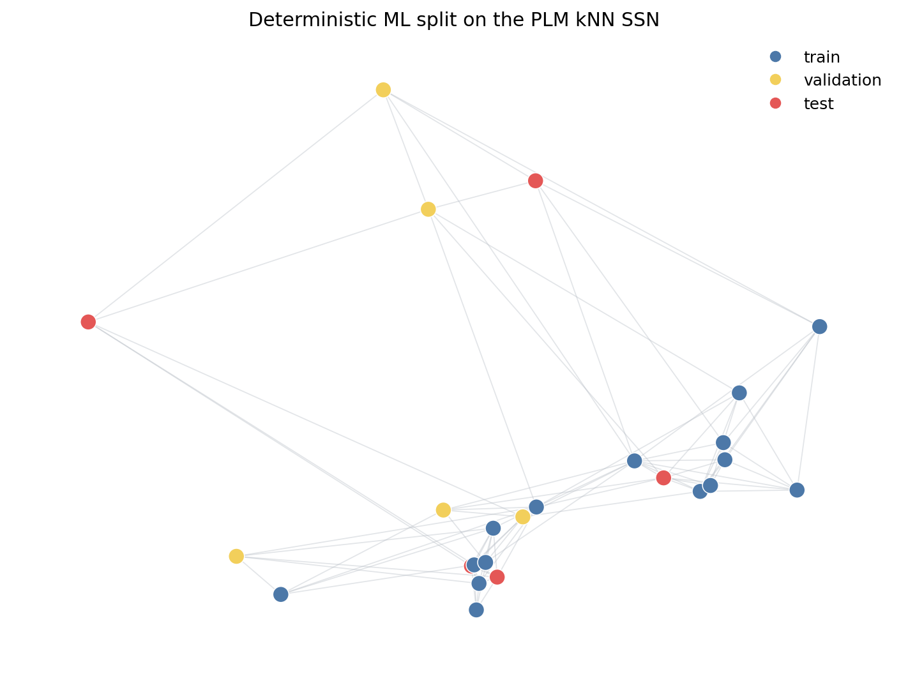
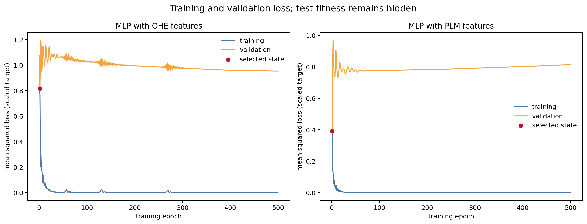
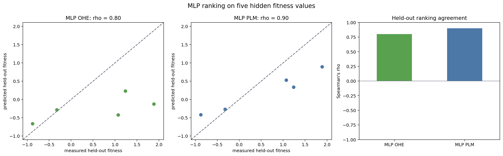
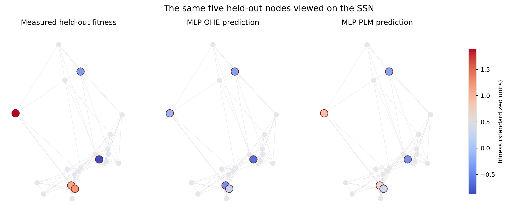

<!-- cookbook: manual -->

# Tutorial: ML training and inference on an SSN

This tutorial continues directly from [Tutorial: Quantitative analysis of an
SSN](tutorial-quantitative-analysis-of-an-ssn.md). Run the two SSN tutorials in
order and keep the same Python session open. They leave us with:

- `knn_landscape`, an annotated `FitnessLandscape` with PLM embeddings and a
  `fitness_mean` layer;
- `positions`, the two-dimensional display coordinates used in the earlier
  figures; and
- 25 sequences whose example fitness values are synthetic.

We will not construct the SSN again. Instead, we will use `landscapy-ml` as an
adapter between this existing Landscapy object and ordinary PyTorch code.

The central idea is that your model does not need to know how Landscapy stores
sequences or fitness layers. Two small interface objects make the connection:

1. a `LandscapeInputAdapter` reads model inputs from a landscape in canonical
   sequence order; and
2. a `ModelAdapter` presents your fitted model's prediction method and output
   type to the bridge.

The bridge then selects its built-in numeric output adapter and returns the
predictions as a new fitness layer. We will demonstrate this interface with
the same simple multilayer perceptron (MLP) trained once on one-hot-encoded
(OHE) sequence features and once on protein-language-model (PLM) embeddings.

In the numbered tutorial you will:

1. make a deterministic training, validation, and held-out test split;
2. hide the test fitness values in a separate training layer;
3. export OHE and PLM tensors through the bridge;
4. train the MLP on each feature representation;
5. adapt the trained models and their inputs for landscape-wide inference;
6. attach predictions as new fitness layers; and
7. measure held-out ranking with Spearman's rho and show the results in figures.

## Preface: an existing PyTorch model

The rest of this tutorial assumes that the model has already been defined. It
is a generic PyTorch object, not a model defined in Landscapy. The example uses
the following `SimpleMLP`; users can substitute another model when they create
the model adapter later in the tutorial.

```python
from pathlib import Path

import matplotlib.pyplot as plt
from matplotlib.lines import Line2D
import networkx as nx
import numpy as np
import pandas as pd
from scipy.stats import spearmanr
import torch
from torch import nn
from torch.utils.data import DataLoader, TensorDataset

from fitness_landscape import NumericFitness
from landscapyml import (
    LandscapeDataset,
    LandscapeInputAdapter,
    ModelAdapter,
    export_landscape_records,
    infer_fitness_layer_from_landscape,
    make_fitness_target_getter,
    make_preferred_input_getter,
)

ML_FIGURE_DIR = Path("docs/cookbook/tutorial_ml_ssn_figures")
ML_FIGURE_DIR.mkdir(parents=True, exist_ok=True)
DEVICE = torch.device("cpu")
```

An MLP treats every sequence as an independent row of numbers. We will fit the
same architecture twice so that the only deliberate difference is its input
representation. `SimpleMLP` has no Landscapy imports, `predict` method, or
fitness-layer attributes.

```python
class SimpleMLP(nn.Module):
    """A two-hidden-layer regressor for one vector per sequence."""

    def __init__(
        self,
        input_width,
        feature_mean,
        feature_scale,
        target_mean,
        target_scale,
    ):
        super().__init__()
        self.register_buffer("feature_mean", feature_mean.clone())
        self.register_buffer("feature_scale", feature_scale.clone())
        self.register_buffer("target_mean", target_mean.clone())
        self.register_buffer("target_scale", target_scale.clone())
        self.network = nn.Sequential(
            nn.Linear(input_width, 64),
            nn.ReLU(),
            nn.Linear(64, 32),
            nn.ReLU(),
            nn.Linear(32, 1),
        )

    def forward(self, features):
        if features.ndim == 1:
            features = features.unsqueeze(0)
        features = features.reshape(features.shape[0], -1)
        normalized = (features - self.feature_mean) / self.feature_scale
        standardized_prediction = self.network(normalized).squeeze(-1)
        return standardized_prediction * self.target_scale + self.target_mean
```

## 1. Make a deterministic split and mask the test fitness

We first copy the complete measured response into `measured_fitness`. This is
the answer key used only after fitting. A fixed random-number seed then assigns
60% of the sequences to training, 20% to validation, and 20% to testing.

The validation rows help select a fitted state during training. The test rows
are not used to fit parameters or choose a state. We replace only their values
with `NaN` in a new layer named `fitness_for_ml`. The original `fitness_mean`
layer remains unchanged because predictions should never overwrite
measurements.

This random split mostly asks an interpolation question: can a model rank
unseen values among similar sequences represented in the same dataset? A
family, time, mutation-order, or low-to-high-fitness split asks a harder and
different question.

The block below also shows the fixed split on the existing display layout.
Node positions and edges are unchanged.

```python
measured_fitness = (
    knn_landscape.fitness_layers["fitness_mean"].to_scalar().astype(float).copy()
)
number_of_sequences = len(measured_fitness)

split_rng = np.random.default_rng(20260916)
shuffled_rows = split_rng.permutation(number_of_sequences)
number_test = max(1, round(0.20 * number_of_sequences))
number_validation = max(1, round(0.20 * number_of_sequences))

test_rows = np.sort(shuffled_rows[:number_test])
validation_rows = np.sort(
    shuffled_rows[number_test:number_test + number_validation]
)
train_rows = np.sort(shuffled_rows[number_test + number_validation:])

split_labels = np.full(number_of_sequences, "train", dtype=object)
split_labels[validation_rows] = "validation"
split_labels[test_rows] = "test"

fitness_for_ml = measured_fitness.copy()
fitness_for_ml[test_rows] = np.nan

knn_landscape.attach(
    NumericFitness.from_scalars(
        "fitness_for_ml",
        fitness_for_ml,
        metadata={
            "source_layer": "fitness_mean",
            "test_rows_masked": True,
            "split_seed": 20260916,
        },
    )
)
split_table = pd.DataFrame(
    {"split": split_labels},
    index=[sequence.id for sequence in knn_landscape.sequences],
)
knn_landscape.attach_annotation(
    name="ml_split",
    data=split_table,
    map_by="name",
    metadata={"seed": 20260916, "fractions": "60% train, 20% validation, 20% test"},
)
knn_landscape.view("fitness_for_ml")

print(pd.Series(split_labels, name="split").value_counts())
print(f"Hidden fitness values: {np.isnan(knn_landscape.get_signal()).sum()}")

split_colours = {
    "train": "#4c78a8",
    "validation": "#f2cf5b",
    "test": "#e45756",
}
node_colours = [
    split_colours[split_labels[knn_landscape.sequence_index_for_node(node)]]
    for node in knn_landscape.graph.nodes
]

fig, ax = plt.subplots(figsize=(8, 6))
nx.draw_networkx_edges(
    knn_landscape.graph,
    positions,
    ax=ax,
    edge_color="#b8bec6",
    alpha=0.40,
    width=0.7,
)
nx.draw_networkx_nodes(
    knn_landscape.graph,
    positions,
    ax=ax,
    node_color=node_colours,
    node_size=100,
    edgecolors="white",
    linewidths=0.6,
)
ax.legend(
    handles=[
        Line2D(
            [0],
            [0],
            marker="o",
            linestyle="",
            color=colour,
            label=label,
        )
        for label, colour in split_colours.items()
    ],
    frameon=False,
)
ax.set_title("Deterministic ML split on the PLM kNN SSN")
ax.set_axis_off()
fig.tight_layout()
fig.savefig(ML_FIGURE_DIR / "ml_split.png", dpi=180, bbox_inches="tight")
plt.show()
```



## 2. Export OHE and PLM tensors through `landscapy-ml`

`export_landscape_records` asks the existing landscape for row-aligned
features and the named masked target. Each exported record corresponds to the
same row of `knn_landscape.sequences`. This avoids maintaining a second,
potentially inconsistent sequence order.

`LandscapeDataset` turns those records into an ordinary PyTorch dataset. For
OHE, each amino-acid position becomes a row containing one one and the
remaining zeros, and we flatten the position-by-alphabet matrix for the MLP.
For PLM, each sequence is already represented by one fixed-width vector that
Landscapy computed earlier.

```python
def export_mlp_tensors(feature_view):
    include_embeddings = feature_view == "embedding"
    exported = export_landscape_records(
        knn_landscape,
        fitness_layers=["fitness_for_ml"],
        feature_view=feature_view,
        include_embeddings=include_embeddings,
    )
    feature_key = "embedding" if include_embeddings else "sequence_tensor"
    dataset = LandscapeDataset(
        exported.records,
        input_getter=make_preferred_input_getter(feature_key),
        target_getter=make_fitness_target_getter(
            "fitness_for_ml",
            dtype=torch.float32,
        ),
    )

    feature_rows = []
    target_rows = []
    for row in range(len(dataset)):
        feature, target = dataset[row]
        feature_rows.append(feature.reshape(-1).float())
        target_rows.append(target.float())
    return torch.stack(feature_rows), torch.stack(target_rows), exported


ohe_features, ohe_targets, ohe_export = export_mlp_tensors("ohe")
plm_features, plm_targets, plm_export = export_mlp_tensors("embedding")

print(
    pd.DataFrame(
        {
            "records": [len(ohe_export.records), len(plm_export.records)],
            "tensor shape": [tuple(ohe_features.shape), tuple(plm_features.shape)],
            "hidden targets": [
                int(torch.isnan(ohe_targets).sum()),
                int(torch.isnan(plm_targets).sum()),
            ],
        },
        index=["OHE", "PLM"],
    )
)
```

Both target tensors contain `NaN` in exactly the five test rows. The fitting
function addresses only `train_rows` and `validation_rows`, so those hidden
values cannot enter either the loss or model selection.

## 3. Train the OHE and PLM MLPs

The same training function now receives each exported tensor. Fixed seeds make
parameter initialisation repeatable. The test values remain hidden throughout
this block.

The training curve should fall as the model learns the labelled rows. The
validation curve often stops improving earlier (its lowest point selects the
saved state). A low training loss with rising validation loss is overfitting:
the model is learning the training rows without improving on unseen labelled
rows.

```python
def train_mlp(features, targets, *, seed, epochs=500):
    """Fit one MLP and retain the state with the lowest validation loss."""
    torch.manual_seed(seed)

    train_index = torch.as_tensor(train_rows, dtype=torch.long)
    validation_index = torch.as_tensor(validation_rows, dtype=torch.long)

    feature_mean = features[train_index].mean(dim=0)
    feature_scale = features[train_index].std(dim=0, unbiased=False)
    feature_scale = torch.where(
        feature_scale < 1e-8,
        torch.ones_like(feature_scale),
        feature_scale,
    )
    target_mean = targets[train_index].mean()
    target_scale = targets[train_index].std(unbiased=False).clamp_min(1e-6)

    model = SimpleMLP(
        input_width=features.shape[1],
        feature_mean=feature_mean,
        feature_scale=feature_scale,
        target_mean=target_mean,
        target_scale=target_scale,
    ).to(DEVICE)
    features = features.to(DEVICE)
    targets = targets.to(DEVICE)
    train_index = train_index.to(DEVICE)
    validation_index = validation_index.to(DEVICE)

    optimizer = torch.optim.Adam(model.parameters(), lr=0.005, weight_decay=1e-4)
    history = []
    best_validation_loss = float("inf")
    best_state = None

    for epoch in range(1, epochs + 1):
        model.train()
        optimizer.zero_grad()
        prediction = model(features)
        train_error = (
            prediction[train_index] - targets[train_index]
        ) / model.target_scale
        loss = torch.mean(train_error**2)
        loss.backward()
        optimizer.step()

        model.eval()
        with torch.no_grad():
            prediction = model(features)
            train_loss = torch.mean(
                (
                    (prediction[train_index] - targets[train_index])
                    / model.target_scale
                ) ** 2
            ).item()
            validation_loss = torch.mean(
                (
                    (prediction[validation_index] - targets[validation_index])
                    / model.target_scale
                ) ** 2
            ).item()

        history.append(
            {
                "epoch": epoch,
                "train_loss": train_loss,
                "validation_loss": validation_loss,
            }
        )
        if validation_loss < best_validation_loss:
            best_validation_loss = validation_loss
            best_state = {
                name: value.detach().cpu().clone()
                for name, value in model.state_dict().items()
            }

    model.load_state_dict(best_state)
    model.eval()
    return model, pd.DataFrame(history)


mlp_models = {}
mlp_histories = {}

for feature_domain, features, targets, seed in [
    ("ohe", ohe_features, ohe_targets, 20260917),
    ("plm", plm_features, plm_targets, 20260918),
]:
    model, history = train_mlp(
        features,
        targets,
        seed=seed,
        epochs=500,
    )
    mlp_models[feature_domain] = model
    mlp_histories[feature_domain] = history
    selected = history.loc[history["validation_loss"].idxmin()]
    print(
        f"{feature_domain.upper()}: selected epoch {int(selected['epoch'])}, "
        f"validation loss {selected['validation_loss']:.3f}"
    )

fig, axes = plt.subplots(1, 2, figsize=(13, 5))
for ax, feature_domain in zip(axes, ["ohe", "plm"]):
    history = mlp_histories[feature_domain]
    ax.plot(
        history["epoch"],
        history["train_loss"],
        color="#4c78a8",
        label="training",
    )
    ax.plot(
        history["epoch"],
        history["validation_loss"],
        color="#f2a541",
        label="validation",
    )
    selected = history.loc[history["validation_loss"].idxmin()]
    ax.scatter(
        selected["epoch"],
        selected["validation_loss"],
        color="#b2182b",
        zorder=3,
        label="selected state",
    )
    ax.set_xlabel("training epoch")
    ax.set_ylabel("mean squared loss (scaled target)")
    ax.set_title(f"MLP with {feature_domain.upper()} features")
    ax.legend(frameon=False)

fig.suptitle("Training and validation loss; test fitness remains hidden", fontsize=14)
fig.tight_layout()
fig.savefig(ML_FIGURE_DIR / "mlp_training.png", dpi=180, bbox_inches="tight")
plt.show()
```



The selected red point is based on validation data, never test data. It is
reasonable for OHE and PLM to select different epochs because their input
values and fitted optimisation paths differ.

## 4. Adapt your model and landscape inputs for inference

`infer_fitness_layer_from_landscape` needs to know how to obtain one batch of
inputs and how to call the fitted model. It does not require the model class
itself to depend on Landscapy.

### The model adapter

`ModelAdapter` is a small runtime-checkable interface. A compatible object
declares `layer_kind` and implements `predict`. Our wrapper also forwards
`eval` and `to`, which lets the bridge manage ordinary PyTorch evaluation and
device placement.

`layer_kind = "numeric"` asks the bridge to use its built-in numeric output
adapter. `embedding_domain` records the representation expected by this
particular fitted model, allowing the bridge to catch a PLM/OHE mismatch.

### The input adapter

For PLM, the registered `"embedding"` input adapter already reads the active
embedding matrix, batches it, and preserves its provenance.

For OHE, we define `OHEInputAdapter` by implementing the two abstract methods
of `LandscapeInputAdapter`:

- `iter_batches` exports OHE records in landscape order and groups them into
  batches; and
- `to_model_inputs` moves one batch to the model's device.

This adapter is deliberately independent of the training target. It can cast
inference over every sequence, including rows whose fitness is unknown.

```python
class TorchRegressorAdapter:
    """Present an ordinary fitted PyTorch regressor to landscapy-ml."""

    layer_kind = "numeric"

    def __init__(self, model, embedding_domain):
        self.model = model
        self.embedding_domain = embedding_domain

    def eval(self):
        self.model.eval()

    def to(self, device):
        self.model.to(device)
        return self

    def predict(self, inputs):
        return self.model(inputs)


class OHEInputAdapter(LandscapeInputAdapter):
    """Export flattened Landscapy OHE tensors for row-wise inference."""

    name = "ohe"

    def embedding_info(self, landscape):
        return "ohe", None, {"feature_view": "ohe"}

    def metadata(self, landscape):
        return {
            "input_adapter": self.name,
            "embedding_domain": "ohe",
            "feature_view": "ohe",
        }

    def iter_batches(
        self,
        landscape,
        *,
        batch_size,
        num_workers=0,
        device=None,
        **kwargs,
    ):
        exported = export_landscape_records(
            landscape,
            fitness_layers=[],
            feature_view="ohe",
            include_embeddings=False,
        )
        features = torch.stack(
            [
                torch.as_tensor(record["sequence_tensor"], dtype=torch.float32)
                .reshape(-1)
                for record in exported.records
            ]
        )
        yield from DataLoader(
            TensorDataset(features),
            batch_size=batch_size,
            num_workers=num_workers,
            shuffle=False,
        )

    def to_model_inputs(self, batch, *, device=None):
        features = batch[0]
        return features if device is None else features.to(device)


model_adapters: dict[str, ModelAdapter] = {
    "ohe": TorchRegressorAdapter(mlp_models["ohe"], "ohe"),
    "plm": TorchRegressorAdapter(mlp_models["plm"], "plm"),
}

print(
    {
        name: isinstance(adapter, ModelAdapter)
        for name, adapter in model_adapters.items()
    }
)
```

If your own model expects a different input object, keep the same division of
responsibility: make `iter_batches` collect the required landscape data, make
`to_model_inputs` assemble the exact tensor, dictionary, or tuple accepted by
your model, and make the model adapter's `predict` return one output row per
input sequence.

## 5. Cast inference over the landscape and attach prediction layers

We now pass each fitted model adapter and its matching input adapter to the
same inference function. OHE uses the adapter instance defined above. PLM uses
the bridge's registered adapter name, `"embedding"`.

The bridge performs the following operations for both calls:

1. check the model adapter's expected domain against the input adapter;
2. request batches in the landscape's canonical sequence order;
3. call `model_adapter.predict` without recording gradients;
4. convert the returned tensor into a numeric fitness layer; and
5. attach the layer without replacing the measured or masked target.

Predictions are made for all rows. Only predictions at `test_rows` count as
held-out results; fitted values on training and validation rows are useful for
diagnostics but are not test performance.

```python
prediction_layers = {}

prediction_layers["ohe"] = infer_fitness_layer_from_landscape(
    knn_landscape,
    model_adapters["ohe"],
    input_adapter=OHEInputAdapter(),
    batch_size=256,
    layer_name="mlp_ohe_prediction",
    attach=True,
    inplace=True,
)

knn_landscape.set_active_embedding_domain("plm")
prediction_layers["plm"] = infer_fitness_layer_from_landscape(
    knn_landscape,
    model_adapters["plm"],
    input_adapter="embedding",
    batch_size=256,
    layer_name="mlp_plm_prediction",
    attach=True,
    inplace=True,
)

knn_landscape.view("fitness_for_ml")

adapter_summary = pd.DataFrame(
    {
        domain.upper(): {
            "layer": layer.name,
            "input adapter": layer.metadata.get("input_adapter"),
            "model adapter": type(model_adapters[domain]).__name__,
            "feature domain": layer.metadata.get("embedding_domain"),
        }
        for domain, layer in prediction_layers.items()
    }
).T
print(adapter_summary)
print(
    "Original measurement still present:",
    "fitness_mean" in knn_landscape.fitness_layers,
)
```

Passing adapter objects directly is the clearest approach in a tutorial and
works well for application code. If a model or input representation is reused
across a package, `landscapy-ml` also provides registries that let users
resolve those adapters by model class or by name.

## 6. Measure held-out performance with Spearman's rho

Ranking can be useful when the practical goal is to prioritise sequences with
high expected fitness for further work.

The scatter panels show the individual held-out values; the dashed diagonal is
exact numerical agreement. The bar panel reports only Spearman's rho.

```python
test_truth = measured_fitness[test_rows]
test_predictions = {
    f"MLP {domain.upper()}": layer.to_scalar().astype(float)[test_rows]
    for domain, layer in prediction_layers.items()
}
held_out_rho = pd.Series(
    {
        model_name: float(spearmanr(test_truth, predicted).statistic)
        for model_name, predicted in test_predictions.items()
    },
    name="Spearman rho",
)
print(held_out_rho.round(3))

model_colours = {"MLP OHE": "#59a14f", "MLP PLM": "#4c78a8"}
all_test_values = np.concatenate([test_truth] + list(test_predictions.values()))
plot_min = float(all_test_values.min())
plot_max = float(all_test_values.max())
padding = 0.08 * max(plot_max - plot_min, 1e-6)
limits = (plot_min - padding, plot_max + padding)

fig, axes = plt.subplots(1, 3, figsize=(16, 5))
for ax, (model_name, predicted) in zip(axes[:2], test_predictions.items()):
    ax.scatter(
        test_truth,
        predicted,
        s=75,
        color=model_colours[model_name],
        edgecolor="white",
        linewidth=0.7,
    )
    ax.plot(limits, limits, linestyle="--", color="#6b7280")
    ax.set_xlim(limits)
    ax.set_ylim(limits)
    ax.set_xlabel("measured held-out fitness")
    ax.set_ylabel("predicted held-out fitness")
    ax.set_title(f"{model_name}: rho = {held_out_rho[model_name]:.2f}")

held_out_rho.plot.bar(
    ax=axes[2],
    color=[model_colours[name] for name in held_out_rho.index],
    rot=0,
)
axes[2].axhline(0.0, color="#6b7280", linewidth=0.8)
axes[2].set_ylim(-1.0, 1.0)
axes[2].set_ylabel("Spearman's rho")
axes[2].set_title("Held-out ranking agreement")

fig.suptitle("MLP ranking on five hidden fitness values", fontsize=14)
fig.tight_layout()
fig.savefig(ML_FIGURE_DIR / "mlp_performance.png", dpi=180, bbox_inches="tight")
plt.show()
```



In this deterministic run, the OHE model has `rho = 0.8` and the PLM model has
`rho = 0.9`. Both rank the five held-out sequences similarly to their measured
fitness.

Do not change the split, seed, architecture, or training duration after seeing
test rho in order to improve it. That would make the test set part of model
selection and would overstate performance.

## 7. Show the held-out predictions on the SSN

A single rho value summarises rank agreement but does not show which sequences
changed order. The graph view below shows where the held-out nodes lie in the
existing SSN. Grey nodes were not part of the test set. The same five
red-outlined nodes are coloured by measured or predicted fitness using one
common scale.

```python
def draw_test_values(ax, values, title, value_limits):
    nx.draw_networkx_edges(
        knn_landscape.graph,
        positions,
        ax=ax,
        edge_color="#c7cbd1",
        alpha=0.35,
        width=0.7,
    )
    nx.draw_networkx_nodes(
        knn_landscape.graph,
        positions,
        ax=ax,
        node_color="#e5e7eb",
        node_size=85,
        edgecolors="white",
        linewidths=0.5,
    )
    test_nodes = [knn_landscape.node_for_sequence_index(row) for row in test_rows]
    coloured_nodes = nx.draw_networkx_nodes(
        knn_landscape.graph,
        positions,
        nodelist=test_nodes,
        ax=ax,
        node_color=values[test_rows],
        cmap="coolwarm",
        vmin=value_limits[0],
        vmax=value_limits[1],
        node_size=150,
        edgecolors="#7f1d1d",
        linewidths=1.0,
    )
    ax.set_title(title)
    ax.set_axis_off()
    return coloured_nodes


landscape_predictions = {
    f"MLP {domain.upper()}": layer.to_scalar().astype(float)
    for domain, layer in prediction_layers.items()
}
held_out_values = np.concatenate(
    [measured_fitness[test_rows]]
    + [prediction[test_rows] for prediction in landscape_predictions.values()]
)
colour_limits = (float(held_out_values.min()), float(held_out_values.max()))

fig, axes = plt.subplots(1, 3, figsize=(16, 5.5))
coloured_nodes = draw_test_values(
    axes[0],
    measured_fitness,
    "Measured held-out fitness",
    colour_limits,
)
for ax, (model_name, prediction) in zip(axes[1:], landscape_predictions.items()):
    coloured_nodes = draw_test_values(
        ax,
        prediction,
        f"{model_name} prediction",
        colour_limits,
    )

fig.colorbar(
    coloured_nodes,
    ax=axes,
    shrink=0.78,
    label="fitness (standardized units)",
)
fig.suptitle("The same five held-out nodes viewed on the SSN", fontsize=14)
fig.savefig(
    ML_FIGURE_DIR / "held_out_predictions_on_ssn.png",
    dpi=180,
    bbox_inches="tight",
)
plt.show()
```



Look for test nodes whose colours differ between the measured and prediction
panels. Nearby errors can suggest weak training support or a model limitation,
but their graph location does not by itself show that network position caused
the error.

## Reuse the adapter pipeline with your own model

Keep the order of operations and replace the tutorial-specific choices:

1. Start with a `FitnessLandscape` whose graph, annotations, measured numeric
   fitness layer, and required embeddings have already been created.
2. Preserve the complete measured target. Add a separate training-target layer
   with genuinely unavailable test values represented by `NaN`.
3. Use `export_landscape_records` and `LandscapeDataset` to train without
   changing the canonical landscape row order.
4. Keep your existing model class focused on modelling. Write a small
   `ModelAdapter`-compatible wrapper that declares the output `layer_kind` and
   forwards `predict`.
5. Use the registered `"embedding"` input adapter for a model that consumes the
   active landscape embedding. Otherwise, subclass `LandscapeInputAdapter` and
   implement `iter_batches` plus `to_model_inputs` for your model's exact input
   object.
6. Call `infer_fitness_layer_from_landscape` with the matching model and input
   adapters. Give every prediction layer a new, descriptive name.
7. Inspect the attached metadata and return the active landscape view to the
   measured or masked layer after inference.

The reusable boundary is therefore small: the input adapter supplies
row-aligned batches, the model adapter supplies predictions, and the bridge
casts those predictions back into the landscape data model. The fitted network
can be your own PyTorch class, a model from another library, or a wrapper around
an existing prediction service, provided the adapter returns one numeric value
for each input sequence.
