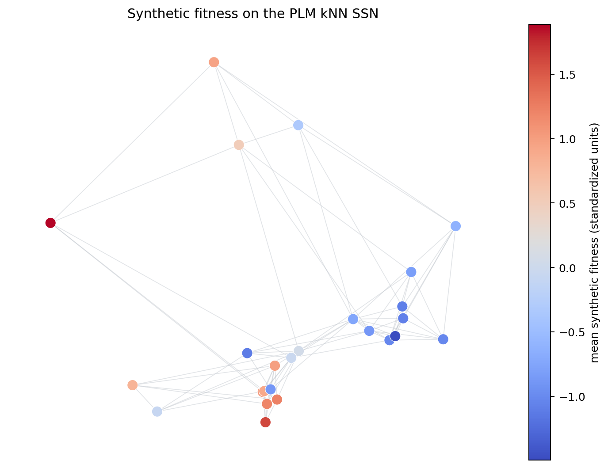
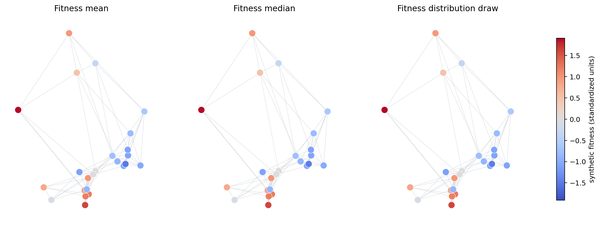
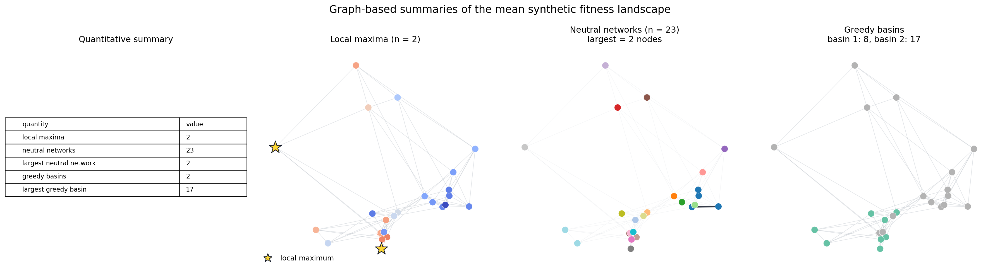
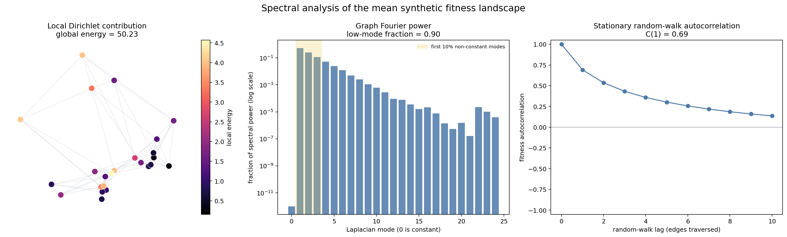
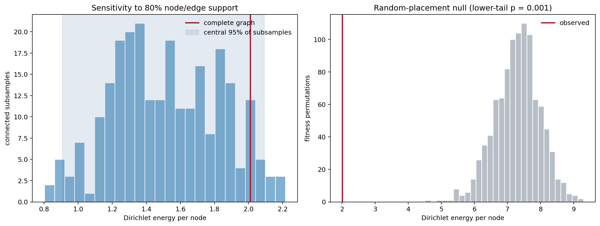

<!-- cookbook: manual -->

# Tutorial: Quantitative analysis of an SSN

This tutorial continues directly from [Tutorial: constructing and analysing an
SSN](tutorial-constructing-and-analysing-an-ssn.md). Run that tutorial first and
keep the same Python session open. It leaves us with `knn_landscape`, an
annotated `FitnessLandscape`, and `positions`, the two-dimensional display
coordinates used in its figures. We will add fitness measurements to that
existing object; we will not construct the SSN again.

The example fitness values are **synthetic**. They are deliberately made
smooth over the graph, with about 90% of their non-constant spectral power in
the first 10% of Laplacian modes and a small amount of power in every other
mode. This mimics an anticipated distribution in which similar sequences tend
to have similar fitness while preserving local variation. It is useful for
learning the analysis workflow, but it is not evidence about the biology of
the solute-binding proteins in the SSN.

In the numbered tutorial you will:

1. create five deterministic synthetic experimental replicates;
2. attach those replicates as a new fitness layer;
3. switch the visible fitness between the replicate mean, median, and a draw
   from the replicate distribution;
4. quantify and plot local maxima, neutral networks, and greedy basins of
   attraction;
5. calculate and plot Dirichlet energy, the graph Fourier transform, and
   random-walk autocorrelation; and
6. examine the robustness of Dirichlet energy with graph subsampling and a
   fitness-permutation null.

## 1. Prepare the continuation

The imports below cover every subsequent block. `knn_landscape` and
`positions` come from the preceding tutorial. We use an unweighted graph for
all quantitative analyses so that graph construction and analysis share one
clearly stated convention.

The analytical autocorrelation used later requires a connected graph. The
tutorial kNN graph is connected. For your own disconnected SSN, analyze an
appropriate component returned by `landscape.get_components()` and state that
component-selection rule in the report.

```python
from pathlib import Path

import matplotlib.pyplot as plt
from matplotlib.lines import Line2D
import networkx as nx
import numpy as np
import pandas as pd

from fitness_landscape import NumericFitness
from fitness_landscape.analysis import (
    analyze_fitness_distribution,
    calculate_basin_of_attraction_greedy,
    calculate_ruggedness_autocorrelation_analytical,
    calculate_ruggedness_dirichlet_energy,
    calculate_ruggedness_local_optima,
    local_dirichlet_energy_contribution,
    neutral_network_analysis,
    subsample_analysis,
)
from fitness_landscape.core.fitness import ResampleFitnessModifier
from fitness_landscape.transforms import (
    eigenmode_decomposition,
    graph_fourier_transform,
)

QUANT_FIGURE_DIR = Path("docs/cookbook/tutorial_quantitative_ssn_figures")
QUANT_FIGURE_DIR.mkdir(parents=True, exist_ok=True)

if not nx.is_connected(knn_landscape.graph):
    raise ValueError(
        "This tutorial analyzes one connected graph. Select a connected "
        "component with knn_landscape.get_components() first."
    )

print(
    f"Continuing with {knn_landscape.graph.number_of_nodes()} nodes, "
    f"{knn_landscape.graph.number_of_edges()} edges, and annotation layers "
    f"{sorted(knn_landscape.annotation_layers)}"
)
```

## 2. Create five synthetic fitness replicates

The graph Laplacian has one eigenvector for each node. Low-frequency
eigenvectors change slowly between connected nodes; high-frequency
eigenvectors change rapidly. A weighted sum of low-frequency vectors therefore
creates broad, smooth hills and valleys on the SSN.

The zero-frequency eigenvector is constant over this connected graph. We omit
it because it would only add the same number to every sequence. For the other
modes, `power_envelope` decreases exponentially with mode rank. Its decay rate
puts approximately 90% of the power in the first 10% of the non-constant
modes. Each replicate adds an independently seeded value drawn uniformly from
`[-SIGMA, SIGMA]` to every coefficient. That small common noise scale leaves
some power throughout the spectrum while preserving the shared smooth signal.

The rows of an eigenvector matrix follow graph-node order, whereas a fitness
layer follows sequence order. The explicit conversion near the end of the
block is important when graph nodes are not integers in sequence order.

```python
node_order = list(knn_landscape.graph.nodes())
laplacian_eigenvalues, laplacian_eigenvectors = eigenmode_decomposition(
    knn_landscape,
    matrix="laplacian",
    weight_key=None,
)

nonconstant_modes = np.flatnonzero(laplacian_eigenvalues > 1e-10)
low_mode_count = max(1, int(np.ceil(0.10 * len(nonconstant_modes))))
decay_rate = -np.log(0.10) / low_mode_count
mode_ranks = np.arange(len(nonconstant_modes))
power_envelope = np.exp(-decay_rate * mode_ranks)

# Alternating signs give the shared smooth signal more than one broad peak.
base_signs = np.where(mode_ranks % 2 == 0, 1.0, -1.0)
base_coefficients = base_signs * np.sqrt(power_envelope)

SIGMA = 0.01
REPLICATE_SEEDS = [20260908, 20260909, 20260910, 20260911, 20260912]
replicate_node_columns = []
low_power_fractions = []

for seed in REPLICATE_SEEDS:
    rng = np.random.default_rng(seed)
    coefficients = np.zeros(len(laplacian_eigenvalues))
    coefficients[nonconstant_modes] = base_coefficients + rng.uniform(
        -SIGMA,
        SIGMA,
        size=len(nonconstant_modes),
    )

    node_values = laplacian_eigenvectors @ coefficients
    node_values = (node_values - node_values.mean()) / node_values.std(ddof=0)
    replicate_node_columns.append(node_values)

    recovered_coefficients = laplacian_eigenvectors.T @ node_values
    nonconstant_power = recovered_coefficients[nonconstant_modes] ** 2
    low_power_fractions.append(
        nonconstant_power[:low_mode_count].sum() / nonconstant_power.sum()
    )

fitness_replicates = np.empty((len(knn_landscape.sequences), len(REPLICATE_SEEDS)))
for graph_row, node in enumerate(node_order):
    sequence_row = knn_landscape.sequence_index_for_node(node)
    fitness_replicates[sequence_row, :] = np.array(replicate_node_columns)[:, graph_row]

spectral_design = pd.DataFrame(
    {
        "seed": REPLICATE_SEEDS,
        "low-frequency power (%)": 100 * np.array(low_power_fractions),
    },
    index=[f"replicate {number}" for number in range(1, 6)],
)
print(spectral_design.round(2))
```

The seeds make the five columns exactly reproducible. The replicate columns
are five measurements of one deliberately constructed latent pattern.
Standardizing each column gives convenient arbitrary fitness units and does
not change its fraction of spectral power.

## 3. Attach the replicated fitness layer

`NumericFitness.from_tensor` expects one row per sequence and one column per
replicate. Attaching the layer leaves the taxonomy annotation and graph
unchanged. Calling `view` makes this the active layer used by analysis
functions. A replicated numeric layer is reduced to its row mean by default.

```python
synthetic_layer = NumericFitness.from_tensor(
    name="synthetic_fitness",
    tensor=fitness_replicates,
    metadata={
        "data_kind": "synthetic tutorial data",
        "replicate_seeds": REPLICATE_SEEDS,
        "laplacian": "unweighted combinatorial",
        "spectral_power": "exponential decay plus uniform coefficient noise",
        "uniform_sigma": SIGMA,
    },
)
knn_landscape.attach(synthetic_layer)
knn_landscape.view("synthetic_fitness")

replicate_table = pd.DataFrame(
    fitness_replicates,
    index=[sequence.id for sequence in knn_landscape.sequences],
    columns=[f"replicate_{number}" for number in range(1, 6)],
)
replicate_table["mean"] = synthetic_layer.to_scalar(aggregate_func=np.mean)
replicate_table["median"] = synthetic_layer.to_scalar(aggregate_func=np.median)

print(f"Active fitness layer: {knn_landscape.active_layer_name}")
print(replicate_table.head().round(3))
```

The sequence IDs in the table are the same accession IDs used for the
taxonomy. On a real dataset, this is where you should check that replicate
columns describe the intended sequence rows before calculating a landscape
metric.

## 4. Plot fitness over the SSN

This helper preserves the PCA display positions from the first tutorial and
changes only node colour. It accepts fitness in sequence order and converts it
to graph-node order before drawing.

```python
def values_in_node_order(landscape, sequence_values):
    return np.array(
        [sequence_values[landscape.sequence_index_for_node(node)] for node in landscape.graph.nodes]
    )


def draw_numeric_graph(ax, landscape, positions, sequence_values, title, *, cmap="coolwarm"):
    plotted_values = values_in_node_order(landscape, sequence_values)
    nx.draw_networkx_edges(
        landscape.graph,
        positions,
        ax=ax,
        edge_color="#b8bec6",
        alpha=0.40,
        width=0.7,
    )
    nodes = nx.draw_networkx_nodes(
        landscape.graph,
        positions,
        ax=ax,
        node_color=plotted_values,
        cmap=cmap,
        node_size=95,
        edgecolors="white",
        linewidths=0.5,
    )
    ax.set_title(title)
    ax.set_axis_off()
    return nodes


mean_fitness = synthetic_layer.to_scalar(aggregate_func=np.mean)
fig, ax = plt.subplots(figsize=(8, 6))
nodes = draw_numeric_graph(
    ax,
    knn_landscape,
    positions,
    mean_fitness,
    "Fitness on the PLM kNN SSN",
)
fig.colorbar(nodes, ax=ax, label="mean fitness (standardized units)")
fig.tight_layout()
fig.savefig(QUANT_FIGURE_DIR / "synthetic_fitness.png", dpi=180, bbox_inches="tight")
plt.show()
```



Warm nodes have higher fitness and cool nodes have lower fitness. The positions
still show a two-dimensional PCA projection and the edges still show PLM kNN
connections; neither was calculated from fitness.

## 5. Change the visible summary of the replicates

The mean and median answer slightly different questions. The mean uses every
replicate value and is sensitive to extremes; the median selects the central
replicate and is more resistant to one unusual measurement. We preserve both
as named scalar layers so later results state exactly which reduction was
used.

`ResampleFitnessModifier` fits a Gaussian from each sequence's five replicate
values and draws one value from each fitted distribution. This is useful for
propagating replicate variability through an analysis.

```python
median_fitness = synthetic_layer.to_scalar(aggregate_func=np.median)
knn_landscape.attach(
    NumericFitness.from_scalars(
        "fitness_mean",
        mean_fitness,
        metadata={"source_layer": "synthetic_fitness", "reduction": "mean"},
    )
)
knn_landscape.attach(
    NumericFitness.from_scalars(
        "fitness_median",
        median_fitness,
        metadata={"source_layer": "synthetic_fitness", "reduction": "median"},
    )
)
distribution_layer = knn_landscape.apply_fitness_modifier(
    ResampleFitnessModifier(reps=1, seed=20260913),
    source_layer="synthetic_fitness",
    output_name="fitness_distribution_draw",
)
distribution_fitness = distribution_layer.to_scalar()

fitness_views = {
    "fitness_mean": mean_fitness,
    "fitness_median": median_fitness,
    "fitness_distribution_draw": distribution_fitness,
}
distribution_rows = []
for layer_name in fitness_views:
    knn_landscape.view(layer_name)
    summary = analyze_fitness_distribution(knn_landscape, nan_policy="raise")
    distribution_rows.append(
        {
            "visible layer": layer_name,
            "mean": summary["mean"],
            "median": summary["median"],
            "standard deviation": summary["std"],
        }
    )

print(pd.DataFrame(distribution_rows).set_index("visible layer").round(3))
print(f"The last call made {knn_landscape.active_layer_name!r} visible")

colour_limit = max(np.max(np.abs(values)) for values in fitness_views.values())
fig, axes = plt.subplots(1, 3, figsize=(17, 5.5))
for ax, (layer_name, values) in zip(axes, fitness_views.items()):
    nodes = draw_numeric_graph(
        ax,
        knn_landscape,
        positions,
        values,
        layer_name.replace("_", " ").capitalize(),
    )
    nodes.set_clim(-colour_limit, colour_limit)
fig.colorbar(nodes, ax=axes, shrink=0.78, label="fitness (standardized units)")
fig.savefig(QUANT_FIGURE_DIR / "fitness_views.png", dpi=180, bbox_inches="tight")
plt.show()

# Use the replicate mean for the remaining sections.
knn_landscape.view("fitness_mean")
```



The three views are similar because the replicates are precise, but
they are different active signals. On noisier experimental data, rerun the
analysis across justified reductions or distribution draws instead of silently
choosing the most attractive result.

## 6. Measure maxima, neutral networks, and basins of attraction

A **local maximum** is a node with no represented neighbour of higher fitness.
A **neutral edge** joins two neighbours whose fitness difference is no larger
than a declared threshold; connected neutral edges form neutral networks, and
a node with no neutral edge is reported as a one-node network. A **greedy basin
of attraction** contains starting nodes whose repeated move to the fittest
neighbour ends at a particular local maximum.

Here the neutrality threshold is twice the median between-replicate standard
deviation. It is therefore tied to the resolution of this experiment rather
than chosen after looking at the neutral-network plot.

```python
replicate_sd = fitness_replicates.std(axis=1, ddof=1)
neutral_threshold = float(2.0 * np.median(replicate_sd))

optima = calculate_ruggedness_local_optima(knn_landscape)
neutral = neutral_network_analysis(knn_landscape, threshold=neutral_threshold)
basins = [
    calculate_basin_of_attraction_greedy(
        knn_landscape,
        knn_landscape.sequences[sequence_index],
    )
    for sequence_index in optima["local_optima_indices"]
]

basin_by_node = {}
for basin_number, basin in enumerate(basins):
    for node in basin["basin"]:
        basin_by_node[node] = basin_number

neutral_network_by_node = {}
for network_number, network in enumerate(neutral["networks"]):
    for node in network["nodes"]:
        neutral_network_by_node[node] = network_number

graphical_summary = pd.DataFrame(
    [
        {
            "quantity": "local maxima",
            "value": optima["local_optima_count"],
            "plain-English meaning": "peaks under represented kNN neighbours",
        },
        {
            "quantity": "neutral networks",
            "value": neutral["network_count"],
            "plain-English meaning": "fitness-equivalent connected groups",
        },
        {
            "quantity": "largest neutral network",
            "value": neutral["largest_network_size"],
            "plain-English meaning": "nodes in the largest neutral group",
        },
        {
            "quantity": "greedy basins",
            "value": len(basins),
            "plain-English meaning": "destinations under best-neighbour walks",
        },
        {
            "quantity": "largest greedy basin",
            "value": max(basin["basin_size"] for basin in basins),
            "plain-English meaning": "starting nodes reaching the dominant peak",
        },
    ]
)
print(f"Neutrality threshold: {neutral_threshold:.3f} fitness units")
print(graphical_summary.to_string(index=False))
```

The next figure combines those numerical results with their locations on the
graph. The neutral-network panel retains faint non-neutral kNN edges for
context. Colours in the basin and neutral panels are category labels; they do
not imply an ordering.

The following code block is only for rendering the results and is not part of
Landscapy.

```python
fig, axes = plt.subplots(1, 4, figsize=(20, 5.5))

axes[0].axis("off")
table = axes[0].table(
    cellText=graphical_summary[["quantity", "value"]].values,
    colLabels=["quantity", "value"],
    cellLoc="left",
    colLoc="left",
    loc="center",
    colWidths=[0.72, 0.28],
)
table.auto_set_font_size(False)
table.set_fontsize(9)
table.scale(1.0, 1.5)
axes[0].set_title("Quantitative summary")

draw_numeric_graph(
    axes[1],
    knn_landscape,
    positions,
    mean_fitness,
    f"Local maxima (n = {optima['local_optima_count']})",
)
optimum_nodes = optima["local_optima"]
nx.draw_networkx_nodes(
    knn_landscape.graph,
    positions,
    nodelist=optimum_nodes,
    ax=axes[1],
    node_shape="*",
    node_color="#fdd835",
    edgecolors="#111827",
    linewidths=1.0,
    node_size=340,
)
axes[1].legend(
    handles=[Line2D([0], [0], marker="*", linestyle="", color="#fdd835", markeredgecolor="#111827", markersize=13, label="local maximum")],
    frameon=False,
    loc="lower left",
)

nx.draw_networkx_edges(
    knn_landscape.graph,
    positions,
    ax=axes[2],
    edge_color="#d1d5db",
    alpha=0.20,
    width=0.6,
)
neutral_edges = [
    (left, right)
    for left, right in knn_landscape.graph.edges
    if abs(
        mean_fitness[knn_landscape.sequence_index_for_node(left)]
        - mean_fitness[knn_landscape.sequence_index_for_node(right)]
    )
    <= neutral_threshold
]
nx.draw_networkx_edges(
    knn_landscape.graph,
    positions,
    edgelist=neutral_edges,
    ax=axes[2],
    edge_color="#111827",
    alpha=0.85,
    width=2.0,
)
nx.draw_networkx_nodes(
    knn_landscape.graph,
    positions,
    ax=axes[2],
    node_color=[neutral_network_by_node[node] for node in knn_landscape.graph.nodes],
    cmap="tab20",
    node_size=95,
    edgecolors="white",
    linewidths=0.5,
)
axes[2].set_title(
    f"Neutral networks (n = {neutral['network_count']})\n"
    f"largest = {neutral['largest_network_size']} nodes"
)
axes[2].set_axis_off()

nx.draw_networkx_edges(
    knn_landscape.graph,
    positions,
    ax=axes[3],
    edge_color="#b8bec6",
    alpha=0.40,
    width=0.7,
)
nx.draw_networkx_nodes(
    knn_landscape.graph,
    positions,
    ax=axes[3],
    node_color=[basin_by_node[node] for node in knn_landscape.graph.nodes],
    cmap="Set2",
    node_size=95,
    edgecolors="white",
    linewidths=0.5,
)
axes[3].set_title(
    "Greedy basins\n"
    + ", ".join(f"basin {number + 1}: {basin['basin_size']}" for number, basin in enumerate(basins))
)
axes[3].set_axis_off()

fig.suptitle("Graph-based summaries of the mean fitness landscape", fontsize=15)
fig.tight_layout()
fig.savefig(QUANT_FIGURE_DIR / "graphical_analysis.png", dpi=180, bbox_inches="tight")
plt.show()
```



This run has two local maxima and therefore two greedy destinations. A large
basin means many starting sequences reach the same peak under the stated
best-neighbour rule. Most neutral networks are small because few edges fall
within the replicate-based equivalence threshold.

All three results are conditional on the kNN edges that were observed. An
unmeasured or excluded fitter neighbour can turn an apparent maximum into an
ordinary node, split or join a neutral network, and redirect a basin.

## 7. Measure spectral ruggedness and autocorrelation

These analyses describe the same mean signal from complementary angles:

- **Dirichlet energy** adds the squared fitness change across every edge. A
  larger value means sharper neighbour-to-neighbour changes on this graph.
- The **graph Fourier transform** reports how much of the signal lies in each
  Laplacian mode. Low-mode power describes broad graph-scale variation; high-
  mode power describes local alternation.
- **Random-walk autocorrelation** asks how similar fitness remains after a
  random walker moves through the SSN. Slow decay means nearby graph regions
  retain similar values over several steps.

We again pass `weight_key=None` to keep every edge equally weighted.

```python
knn_landscape.view("fitness_mean")

dirichlet = calculate_ruggedness_dirichlet_energy(
    knn_landscape,
    weight_key=None,
)
local_energy = local_dirichlet_energy_contribution(knn_landscape, weight_key=None)

fourier_vectors, fourier_eigenvalues, fourier_coefficients = graph_fourier_transform(
    knn_landscape,
    matrix="laplacian",
    weight_key=None,
)
spectral_power = fourier_coefficients**2
nonconstant_spectral_power = spectral_power[1:]
observed_low_power_fraction = (
    nonconstant_spectral_power[:low_mode_count].sum()
    / nonconstant_spectral_power.sum()
)

autocorrelation = calculate_ruggedness_autocorrelation_analytical(
    knn_landscape,
    lag_max=10,
    weight_key=None,
)

spectral_summary = pd.Series(
    {
        "global Dirichlet energy": dirichlet["global_dirichlet_energy"],
        "Dirichlet energy per node": dirichlet["total_dirichlet_energy"],
        "power in first 10% non-constant modes": observed_low_power_fraction,
        "lag-1 autocorrelation": autocorrelation["autocorrelation"][1],
        "lag-1 equivalent exponential length": autocorrelation[
            "equivalent_single_exponential_length"
        ],
    },
    name="value",
)
print(spectral_summary.round(3))
```

`global_dirichlet_energy` is the once-per-edge total, while
`total_dirichlet_energy` is that total divided by node count.

```python
fig, axes = plt.subplots(1, 3, figsize=(18, 5.5))

local_energy_values = np.array([local_energy[node] for node in knn_landscape.graph.nodes])
nx.draw_networkx_edges(
    knn_landscape.graph,
    positions,
    ax=axes[0],
    edge_color="#b8bec6",
    alpha=0.40,
    width=0.7,
)
energy_nodes = nx.draw_networkx_nodes(
    knn_landscape.graph,
    positions,
    ax=axes[0],
    node_color=local_energy_values,
    cmap="magma",
    node_size=95,
    edgecolors="white",
    linewidths=0.5,
)
axes[0].set_title(
    f"Local Dirichlet contribution\n"
    f"global energy = {dirichlet['global_dirichlet_energy']:.2f}"
)
axes[0].set_axis_off()
fig.colorbar(energy_nodes, ax=axes[0], label="local energy")

power_fraction = spectral_power / spectral_power.sum()
mode_numbers = np.arange(len(power_fraction))
axes[1].bar(mode_numbers, np.maximum(power_fraction, 1e-12), color="#4c78a8", alpha=0.85)
axes[1].axvspan(0.5, low_mode_count + 0.5, color="#f2cf5b", alpha=0.25, label="first 10% non-constant modes")
axes[1].set_yscale("log")
axes[1].set_xlabel("Laplacian mode (0 is constant)")
axes[1].set_ylabel("fraction of spectral power (log scale)")
axes[1].set_title(f"Graph Fourier power\nlow-mode fraction = {observed_low_power_fraction:.2f}")
axes[1].legend(frameon=False, fontsize=8)

axes[2].plot(
    autocorrelation["lags"],
    autocorrelation["autocorrelation"],
    marker="o",
    color="#4c78a8",
)
axes[2].axhline(0.0, color="#9ca3af", linewidth=0.8)
axes[2].set_xlabel("random-walk lag (edges traversed)")
axes[2].set_ylabel("fitness autocorrelation")
axes[2].set_ylim(-1.05, 1.05)
axes[2].set_title(f"Stationary random-walk autocorrelation\nC(1) = {autocorrelation['autocorrelation'][1]:.2f}")

fig.suptitle("Spectral analysis of the mean fitness landscape", fontsize=15)
fig.tight_layout()
fig.savefig(QUANT_FIGURE_DIR / "spectral_analysis.png", dpi=180, bbox_inches="tight")
plt.show()
```



The local-energy panel identifies nodes surrounded by the largest fitness
changes: brighter nodes contribute more strongly to the overall ruggedness.
In the Fourier panel, a left-heavy spectrum indicates broad, smooth fitness
regions, while substantial power in the high-frequency tail indicates rapid
changes between neighbouring sequences. In the autocorrelation panel, slower
decay means fitness remains similar across more graph steps; faster decay means
that similarity is lost over shorter paths.

## 8. Check support robustness and compare with a random null

We use per-node Dirichlet energy because it is fast and has an obvious
direction: lower values mean the fitness assignment is smoother over the
fixed graph.

First, `subsample_analysis` repeatedly keeps 80% of nodes and 80% of their
represented edges while returning a connected observed subgraph. This asks how
much the descriptor changes when graph support is reduced.

Second, we keep the complete graph and fitness-value distribution fixed, but
shuffle which node receives each value. This is the correct permutation unit
for the null question, “Is this fitness assignment smoother than a random
assignment on the same graph?”

```python
def per_node_dirichlet(sample):
    return calculate_ruggedness_dirichlet_energy(sample, weight_key=None)[
        "total_dirichlet_energy"
    ]


subsampled = subsample_analysis(
    knn_landscape,
    per_node_dirichlet,
    n_samples=250,
    subsample_node_prop=0.80,
    subsample_edge_prop=0.80,
    seed=20260914,
    layer_name="fitness_mean",
    use_ray=False,
)
subsample_energies = np.asarray(subsampled["results"], dtype=float)

ordered_fitness = knn_landscape.get_node_signal(node_order)
laplacian = nx.laplacian_matrix(
    knn_landscape.graph,
    nodelist=node_order,
    weight=None,
).astype(float)
observed_energy = dirichlet["total_dirichlet_energy"]

rng = np.random.default_rng(20260915)
n_permutations = 999
null_energies = np.empty(n_permutations)
for permutation_number in range(n_permutations):
    permuted_fitness = rng.permutation(ordered_fitness)
    null_energies[permutation_number] = float(
        permuted_fitness @ (laplacian @ permuted_fitness) / len(node_order)
    )

# The alternative is lower energy (greater smoothness) than random placement.
permutation_p = (1 + np.count_nonzero(null_energies <= observed_energy)) / (
    n_permutations + 1
)

robustness_summary = pd.Series(
    {
        "complete-graph energy per node": observed_energy,
        "subsample mean": subsampled["summary"]["mean"],
        "subsample 2.5% percentile": subsampled["summary"]["ci_low"],
        "subsample 97.5% percentile": subsampled["summary"]["ci_high"],
        "permutation-null median": np.median(null_energies),
        "one-sided permutation p-value": permutation_p,
    },
    name="value",
)
print(robustness_summary.round(3))

fig, axes = plt.subplots(1, 2, figsize=(13, 5))
axes[0].hist(subsample_energies, bins=24, color="#80b1d3", edgecolor="white")
axes[0].axvline(observed_energy, color="#b2182b", linewidth=2, label="complete graph")
axes[0].axvspan(
    subsampled["summary"]["ci_low"],
    subsampled["summary"]["ci_high"],
    color="#4c78a8",
    alpha=0.15,
    label="central 95% of subsamples",
)
axes[0].set_xlabel("Dirichlet energy per node")
axes[0].set_ylabel("connected subsamples")
axes[0].set_title("Sensitivity to 80% node/edge support")
axes[0].legend(frameon=False)

axes[1].hist(null_energies, bins=28, color="#b8bec6", edgecolor="white")
axes[1].axvline(observed_energy, color="#b2182b", linewidth=2, label="observed")
axes[1].set_xlabel("Dirichlet energy per node")
axes[1].set_ylabel("fitness permutations")
axes[1].set_title(f"Random-placement null (lower-tail p = {permutation_p:.3f})")
axes[1].legend(frameon=False)

fig.tight_layout()
fig.savefig(QUANT_FIGURE_DIR / "robustness.png", dpi=180, bbox_inches="tight")
plt.show()
```



Read the left panel by comparing the red complete-graph line with the blue
subsample distribution. A narrow distribution close to the red line means the
energy changes little when support is reduced. A broad or displaced
distribution means the result is more sensitive to which nodes and edges are
retained. Here the red line is near the upper edge, so most reduced graphs have
lower energy than the complete graph.

In the right panel, compare the red observed line with the grey
random-placement distribution. A line far to the left indicates smoother
fitness than most random assignments; overlap with the middle of the histogram
indicates an unexceptional value. The lower-tail p-value is the fraction of
random assignments at least as smooth as the observed one. With 999
permutations, its smallest possible value is `0.001`.

## Reuse the pipeline with experimental fitness

For your own data, retain the workflow but replace `fitness_replicates` with a
numeric array whose rows have been explicitly matched to
`landscape.sequences`.

Continue in the same Python session with [Tutorial: ML training and inference
on an SSN](tutorial-ml-training-and-inference-on-an-ssn.md) to mask a held-out
test set, train MLP and GCN models through `landscapy-ml`, and attach their
predictions as new fitness layers.
